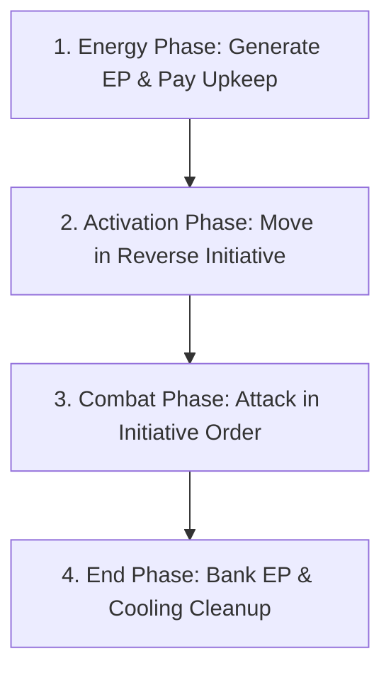

# Iron Protocol — Quick Reference Sheet (QRS)

This player aid card consolidates all phase sequences, sensor matrices, damage steps, and critical hit tables to streamline live tabletop play.

---

## ⏱️ Turn Sequence

### 1. Energy Phase
1. **Energy Generation**: Every Frame generates EP equal to its Reactor Rating. Add to stored Capacitor EP.
2. **Stealth Upkeep**: Spend EP to maintain active Metamaterial Coating (AMC) modes or active ECM suites.

### 2. Activation Phase (Reverse Initiative Order)
*Frames activate from lowest Initiative to highest Initiative. Spend EP step-by-step.*
- **Forward Walk (W)**: 1 EP (climbing +1 EP per vertical level).
- **Reverse (R)**: 2 EP.
- **Pivot/Turn (TL/TR)**: 1 EP per 60 degrees.

- **Jump Jet (J)**: 2 EP per hex (Light and Medium only, straight line, max 4 hexes).
- **Movement Limit**: A Frame cannot enter more hexes than its weight class Movement Limit per turn.
- **Leg vs. Torso Facing**: At the end of activation, torso facing can twist up to 60 degrees left/right of leg facing for free.

### 3. Combat Phase (Initiative Order)
*Resolve attacks in order of highest Initiative to lowest Initiative (instantly resolved).*
1. **Select Weapon & Pay EP Cost**.
2. **Verify Line of Sight (LOS) and Arc** (Torso = Forward Arc, Left Arm = Left Side Arc, Right Arm = Right Side Arc).
3. **Verify Sensor Lock** (Visual, Infrared, or Microwave).
4. **Determine Hit Location**: Roll 2d6.
5. **Roll Damage**: Roll weapon damage dice (+1d6 damage bonus if shooting from 2+ elevation levels higher).
6. **Apply Target Evasion**: Subtract target's current EVA points from damage.
7. **Apply Armor DR**: Subtract hit location's current Armor DR from remaining damage.
8. **Resolve Damage**: Excess damage reduces hit location's Internal Structure (IS). If damage penetrates, permanently reduce that location's Armor DR by 1 (to minimum of 0).
9. **Roll Critical Hits**: If IS took 1+ damage, roll 1d6 on the location's Critical Table.
10. **Location Destruction & Transfer**: If IS reaches 0, the location is destroyed. Torso/Head destruction destroys the Frame (Torso triggers 2d6 Core Melt to adjacent units). Severed Arm/Leg destroys mounted gear, forces fall (Leg), and transfers excess damage directly to the Torso (bypassing DR). Subsequent hits to a destroyed location also transfer directly to the Torso.

### 4. End Phase
1. **Bank Energy**: Store unused EP in the Capacitor (up to Capacitor Max). Excess EP is lost.
2. **Clean Up**: Remove Evasion tokens, decrement cooldowns, and reduce Smoke tokens by 1.

---

## ⚖️ Weight Class Reference

| Chassis Class | Tonnage | Mass Value | Movement Limit | Evasion Limit |
| :--- | :---: | :---: | :---: | :---: |
| **Light** | 20–35 Tons | 1 | 6 hexes | 5 EVA |
| **Medium** | 40–55 Tons | 2 | 5 hexes | 3 EVA |
| **Heavy** | 60–75 Tons | 3 | 4 hexes | 2 EVA |
| **Assault** | 80–100 Tons | 4 | 3 hexes | 1 EVA |

---

## 📡 Sensor, Lock & Stealth Matrix

| Defense System | Visual (VIS) Locks | Infrared (IR) Locks | Microwave (Radar) Locks |
| :--- | :--- | :--- | :--- |
| **Smoke Screen** | **BLOCKED** | *Clear* | *Clear* |
| **Active ECM Suite** | *Clear* | *Clear* | **BLOCKED** |
| **AMC (Visual-Camouflage)** | **BLOCKED** (Target is invisible) | *Clear* | *Clear* |
| **AMC (IR-Suppression)** | *Clear* | **BLOCKED** | *Clear* |
| **AMC (Microwave-Absorbent)** | *Clear* | *Clear* | **BLOCKED** |
| **Flares Countermeasure** | *Clear* | **Breaks seeking lock** (missiles only) | *Clear* |

* **Infrared (IR) Lock Requirement**: Target must have spent **5+ EP** in its last activation to generate a detectable heat signature.
* **Tactical Datalinks**: Shared locks permit teammates with active datalinks to target hidden units.
* **Microwave (Radar)**: Direct LOS. Ignores Woods/Smoke. Blocked by Elevation. Indirect fire requires a Datalink spotter.

---

## 💥 Collision & Pilot Checks
*Triggers when a Frame enters an occupied hex (standard movement or Drop Strike landing).*
* **Collision Damage**:
  $$\text{Damage Sufferred} = \text{Opponent's Mass Value} \times \text{Movement Speed (hexes entered)}$$
  *(Damage is reduced by Evasion and Armor DR normally).*
* **Pilot Check (Both Frames)**:
  $$\text{Pilot Check} = 2d6 + \text{Mass Value} - \text{Movement Speed (or hexes jumped)} + \text{Pilot Initiative Bonus (if applicable)}$$
  - **Success (6+)**: The Frame stands firm.
  - **Failure (5 or less)**: The Frame falls **Prone** (Evasion reduced to 0, cannot Torso Twist, walk, or reverse. Suffers a **-1d6 damage penalty** to all weapon rolls).
  - **Stand Up**: Costs **3 EP** during the Activation Phase.

---

## 🛡️ Attack Directions & Hit Zones
*Incoming attacks are resolved based on the attacker's position relative to the target's Torso Facing:*
* **Front Hit Zone (180°)**: Directly in front (3 hexes). Standard resolution.
* **Left/Right Side Hit Zone (60° each)**: Directly to the side (1 hex each). Attacks cannot be deflected by Flares.
* **Rear Hit Zone (60°)**: Directly behind (1 hex). Bypasses target's movement-generated Evasion (EVA) entirely (EVA is treated as 0).
* **Boundary Hexes (White)**: Defender (target) chooses which of the two adjacent Hit Zones the attack is resolved as.

---

## 🎯 Combat Tables

### 2d6 Hit Location Table

| Roll (2d6) | Left Side Attack | Front / Rear Attack | Right Side Attack |
| :---: | :--- | :--- | :--- |
| **2** | Torso (Core Critical)* | Torso (Core Critical)* | Torso (Core Critical)* |
| **3** | Left Leg | Right Arm | Right Leg |
| **4** | Left Arm | Right Arm | Right Arm |
| **5** | Left Arm | Right Leg | Right Arm |
| **6** | Left Leg | Torso | Right Leg |
| **7** | Torso | Torso | Torso |
| **8** | Torso | Torso | Torso |
| **9** | Torso | Left Leg | Torso |
| **10** | Right Arm | Left Arm | Left Arm |
| **11** | Right Leg | Left Arm | Left Leg |
| **12** | Head (Sensors)** | Head (Sensors)** | Head (Sensors)** |

*\*Torso (Core Critical): Bypasses Torso Armor DR entirely. Damage goes directly to Internal Structure. Torso DR permanently -1.*  
*\*\*Head (Sensors): Contains Sensor Suite (blinds Frame on criticals) and cockpit.*

---

### 1d6 Critical Hit Tables

#### 1. Torso Criticals
* **1: System Glitch**. Frame generates 1 less EP next turn.
* **2: Capacitor Leak**. Capacitor Max reduced by 2; lose 2 stored EP.
* **3: Reactor Damage**. Reactor output permanently reduced by 2 EP/turn.
* **4: Gyro Lock**. Torso twists cost 2 EP (no longer free).
* **5: Ammo Explosion**. If carrying ammunition, explodes for 3d6 damage bypassing armor (otherwise treat as Reactor Damage).
* **6: Core Melt**. Reactor explodes. Deal 2d6 damage to all adjacent hexes. Frame destroyed.

#### 2. Arm Criticals
* **1: Weapon Calibration**. Weapons in this arm cost +1 EP.
* **2: Weapon Damaged**. Attacking player chooses one weapon in this arm; it is destroyed.
* **3: Shoulder Joint Jammed**. Weapons in this arm can only fire into Forward Arc.
* **4: Structural Fracture**. Arm Armor DR reduced to 0.
* **5: Ammo Feed Cut**. Arm weapon ammo weapons disabled.
* **6: Arm Severed**. All weapons/systems in this arm are lost.

#### 3. Leg Criticals
* **1: Toe Actuator**. -1 penalty to all future Pilot checks.
* **2: Knee Lock**. Walking/reversing costs +1 EP.
* **3: Hip Actuator**. Evasion Limit permanently reduced by 1.
* **4: Structural Fracture**. Leg Armor DR reduced to 0.
* **5: Thruster Wrecked**. Jump Jets disabled.
* **6: Leg Severed**. Frame falls Prone and is permanently immobilized.

#### 4. Head (Cockpit) Criticals
* **1: Sensor Flicker**. All locks (VIS/IR/Radar) capped at 5 hexes next turn.
* **2: Comm Static**. Cannot share datalink targeting.
* **3: Pilot Stunned**. Frame generates 0 EP next turn and Capacitor drained to 0 (cannot move or fire).
* **4: Sensor Array Destroyed**. Radar/IR locks disabled. Target blind beyond adjacent hexes.
* **5: Cockpit Breach**. Pilot suffers toxic/pressure venting. Initiative permanently reduced by 3.
* **6: Pilot K.O. / Frame Shutdown**. Frame is permanently disabled.
