# Iron Protocol
**A Tactical Game of Iron Frame Combat**

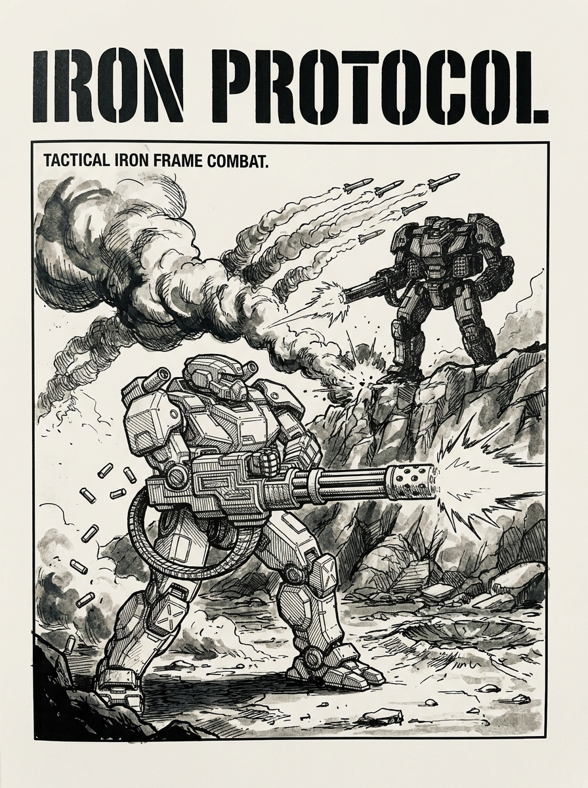

*Fusing tactical resource management and locational damage with fluid turn-order dynamics and initiative-based action.*

---

## Table of Contents
- [Introduction: The Iron Protocol](#introduction-the-iron-protocol)
  - [Why We Fight in Frames](#the-lore-of-the-protocol-why-we-fight-in-frames)
  - [Core Tenets of the Protocol](#core-tenets-of-the-protocol)
- [1. Core Mechanics & Setup](#1-core-mechanics--setup)
  - [1.1 The Hex Grid & Time Scale](#11-the-hex-grid--time-scale)
  - [1.2 The Iron Frame Profile](#12-the-iron-frame-profile)
- [2. Turn Sequence](#2-turn-sequence)
  - [2.1 Energy Phase](#21-energy-phase)
  - [2.2 Activation Phase](#22-activation-phase-reverse-initiative-order)
    - [2.2.1 Movement Examples](#221-movement-examples)
  - [2.3 Combat Phase](#23-combat-phase-initiative-order)
    - [2.3.1 Combat Examples](#231-combat-examples)
  - [2.4 End Phase](#24-end-phase)
- [3. Terrain & Elevation](#3-terrain--elevation)
  - [3.1 Summary of Terrain Types](#31-summary-of-terrain-types)
  - [3.2 Movement & Elevation Rules](#32-movement--elevation-rules)
  - [3.3 Hard Cover vs. Concealment](#33-hard-cover-vs-concealment-sensors--locks)
  - [3.4 Line of Sight (LOS) & Elevation Height Math](#34-line-of-sight-los--elevation-height-math)
  - [3.5 Pilot Checks & Water Cooling](#35-pilot-checks--water-cooling)
- [4. Sensors, Stealth, and Detection](#4-sensors-stealth-and-detection)
  - [4.1 The Sensor Suite](#41-the-sensor-suite-head-location)
  - [4.2 Stealth & Defensive Countermeasures](#42-stealth--defensive-countermeasures)
  - [4.3 Tactical Datalink](#43-tactical-datalink-head-location)
- [5. Weapons & Munitions](#5-weapons--munitions)
  - [5.1 Autocannon Munitions](#51-autocannon-munitions)
  - [5.2 Guided Missile Systems](#52-guided-missile-systems)
  - [5.3 Extra Ammunition Bins](#53-extra-ammunition-bins)
  - [5.4 Universal System Traits](#54-universal-system-traits)
- [6. Damage & Critical Hits](#6-damage--critical-hits)
  - [6.1 Hit Location Table](#61-hit-location-table-2d6)
  - [6.2 Critical Hit Tables](#62-critical-hit-tables-1d6)
  - [6.3 Falling and the Prone State](#63-falling-and-the-prone-state)
  - [6.4 Pilot Checks](#64-pilot-checks)
  - [6.5 Location Destruction & Damage Transfer](#65-location-destruction--damage-transfer)
- [7. Optional Rules](#7-optional-rules)
  - [7.1 Force Organization & Point Limits](#71-force-organization--point-limits)
  - [7.2 Base Chassis & Custom Frames](#72-base-chassis--custom-frames)
  - [7.3 Named Pilots & The Code of Honor](#73-named-pilots--the-code-of-honor)
- [8. Iron Frame Roster](#8-iron-frame-roster)
  - [8.1 IF-25L-1 "Jackal"](#81-if-25l-1-jackal-light-recon-frame)
  - [8.2 IF-45M-1 "Specter"](#82-if-45m-1-specter-medium-stealth-frame)
  - [8.3 IF-55M-1 "Vanguard"](#83-if-55m-1-vanguard-medium-skirmisher-frame)
  - [8.4 IF-75H-1 "Paladin"](#84-if-75h-1-paladin-heavy-fire-support-frame)
  - [8.5 IF-90A-1 "Colossus"](#85-if-90a-1-colossus-heavy-assault-frame)

---

## Introduction: The Iron Protocol
In the war-torn era of a devastated Earth, surface warfare is not decided by faceless drone swarms, heavy tank divisions, or indiscriminate strategic missile strikes. Instead, factional conflicts and territorial disputes are resolved by the pilots of massive, heavily armed walking weapon platforms known as **Iron Frames**. 

These elite pilots adhere to the **Iron Protocol**—an ancient, unyielding code of martial honor and combat conduct inspired by Earth's historical Bushido. The Protocol dictates that territorial conflicts must be settled within designated engagement zones, frame-to-frame, where tactical energy management, maneuverability, and pilot skill determine the victor. To violate the Protocol is to invite immediate dishonor, global outlaw status, and swift retaliation by all allied factions.

### The Lore of the Protocol: Why We Fight in Frames

The emergence of the Iron Protocol was born of necessity, forged from the ashes of the **Cinder Wars**—a period of total industrial warfare that left entire continents scorched, cities in ruins, and Earth's biosphere on the brink of complete collapse. To prevent human extinction, the surviving nation-states and corporations signed the Accords, establishing the Protocol to govern all future terrestrial conflicts.

#### 1. The Preservation of Biospheres & Infrastructure
Earth's remaining arable land, clean water reserves, and surviving industrial infrastructure are humanity's most precious assets. Conventional mass warfare—carpet bombing, tactical nuclear strikes, and massive tank divisions tearing up agricultural land—irreversibly ruins the planet's remaining ecosystems. The Iron Protocol strictly outlaws weapons of mass destruction, strategic bombing, and heavy tracked armor. Battles are confined to designated, unpopulated "Honor Fields" and containment zones to preserve surviving biospheres for the victor.

#### 2. The Iron Aegis (Defensive Grid Networks)
Every major continent and sovereign sector is protected by the **Iron Aegis**—a dense network of anti-ballistic missile silos, automated point-defense artillery, and kinetic interception grids. Any attempt to launch long-range missile strikes or strategic air raids is instantly targeted and neutralized. Ground forces must be deployed via low-altitude stealth dropships directly into tactical engagement zones, bypassing regional defense grids.

#### 3. Bipedal Superiority Over Tanks & Aircraft
Modern Earth battlefields are jagged, unpaved, and volatile. Tectonic fractures, ruined mega-cities, flooded coastal craters, and dense electromagnetic anomalies make standard tracked tanks useless; they are easily bottlenecked in urban canyons or trapped by debris. Fighter aircraft are blinded by heavy particulate smog, thermal storms, and local jamming. **Iron Frames**, with their articulated bipedal limbs and vector thrusters, possess unmatched all-terrain mobility, allowing them to climb rubble, leap chasms, and pivot dynamically in close-quarters combat.

#### 4. The Ban on Autonomous Warfare (The Human Core)
Following a catastrophic AI rebellion that nearly annihilated humanity, treaties strictly outlaw autonomous combat drones and artificial combat intelligences. War must be fought by human pilots, exposing themselves to direct risk. The Iron Frame serves as an extension of the pilot's own body, synchronizing via neural datalink. War is no longer a matter of automated factory output, but a test of personal discipline, honor, and martial skill.

### Core Tenets of the Protocol
- **Honor in the Arc**: Foe must face foe. Torso twisting represents the deliberate, disciplined adjustments of a pilot's stance to align weapons with the enemy.
- **Mastery of Energy**: An Iron Frame's reactor is the pilot's lifeblood. Distributing energy between thruster moves, active countermeasures, and weapons systems is the ultimate test of martial discipline.
- **Precision Striking**: The Protocol forbids mindless destruction. Pilots target specific components—locating and disabling weapons, shields, and sensors systematically to neutralize the opponent with precision.

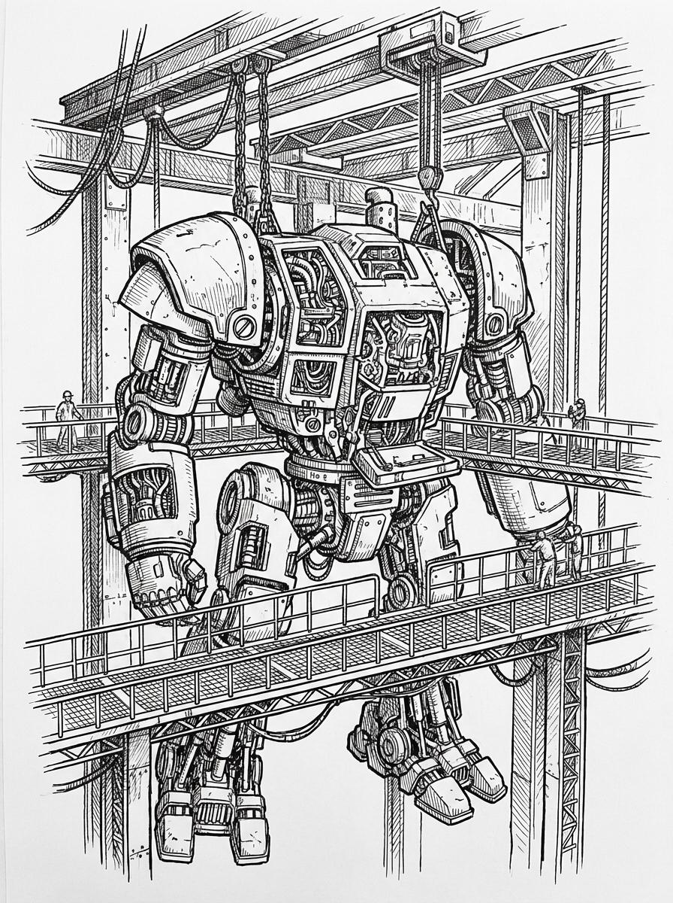
---

## 1. Core Mechanics & Setup
> *"Victorious warriors win first and then go to war, while defeated warriors go to war first and then seek to win." — Sun Tzu*

### 1.1 The Hex Grid & Time Scale
The game is played on a standard hexagonal grid.
- **Distance Scale**: Each hex represents approximately **30 meters** of terrain.
- **Time Scale**: A single combat turn (round) represents approximately **10 seconds** of real-time combat.
- **Facing**: A Frame has two components of facing:
  - **Leg Facing (Movement)**: The direction the legs face, which determines the direction of forward, backward, and diagonal movement.
  - **Torso Facing (Combat)**: The direction the upper body faces. By default, the torso aligns with the leg facing, but a Frame can twist its torso (see Torso Twisting).
- **Torso Twisting**: A Frame's upper body can twist 1 hex side (60 degrees) to the left or right of its current leg facing.
- **Firing Arcs**: Firing arcs are determined relative to the **Torso Facing**, and weapons are restricted to specific arcs based on their mounting location (see Firing Arcs Diagram):
  - **Forward Arc (Torso Weapons Only)**: The 180-degree wedge directly in front of the Torso (covering 3 hexsides: Front-Left, Front, and Front-Right). Only weapons mounted in the **Torso** may fire into this arc.
  - **Left Side Arc (Left Arm Weapons Only)**: The 60-degree wedge covering the direction directly to the left-rear of the Torso (covering 1 hexside: Left-Rear). Only weapons mounted in the **Left Arm** may fire into this arc.
  - **Right Side Arc (Right Arm Weapons Only)**: The 60-degree wedge covering the direction directly to the right-rear of the Torso (covering 1 hexside: Right-Rear). Only weapons mounted in the **Right Arm** may fire into this arc.
  - **Rear Arc**: The 60-degree wedge directly behind the Torso (covering 1 hexside: Rear). No weapons can be fired into the Rear Arc.

- **Attack Directions & Hit Zones**: When a Frame is attacked, the direction of the incoming attack determines the **Hit Zone** relative to the target Frame's **Torso Facing** (see Attack Direction Diagram):
  - **Front Hit Zone**: The 180-degree sector directly in front of the target (covering 3 hexes).
  - **Left Side Hit Zone**: The 60-degree sector to the left of the target (covering 1 hex).
  - **Right Side Hit Zone**: The 60-degree sector to the right of the target (covering 1 hex).
  - **Rear Hit Zone**: The 60-degree sector directly behind the target (covering 1 hex).
  - **Determining the Hit Zone**: Draw a straight line of sight from the center of the attacker's hex to the center of the target's hex. The sector of the target's Torso that this line passes through determines the Hit Zone.
  - **Boundary Hexes (Target's Choice)**: If the line of attack passes exactly along the boundary between two Hit Zones (represented by the white hexes on the Attack Direction Diagram), the target Frame's player (the defender) chooses which of the two adjacent Hit Zones the attack is resolved as.
  - **Gameplay Effects**: 
    - *Rear Hits*: An attack originating from the target's **Rear Hit Zone** bypasses the target's movement-generated Evasion (EVA) entirely (reduce target's current EVA to 0 for this attack). The target still benefits from any static Cover modifiers.
    - *Side Hits*: Attacks originating from the Left/Right Side Hit Zone cannot be deflected by Flares (since countermeasures are optimized for front/rear quadrants).
    - *Vows*: Named Pilots with the `Vow of Respect` cannot declare attacks that originate from the target's **Rear Hit Zone**.

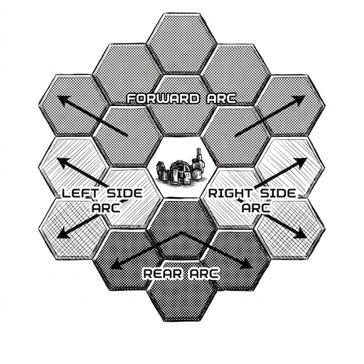

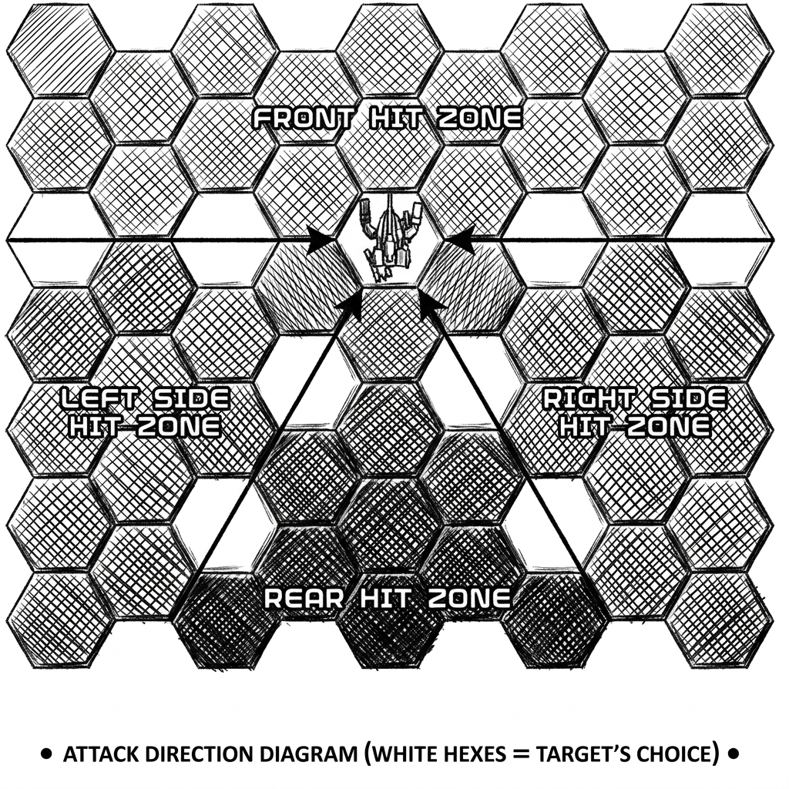

- **Line of Sight (LOS)**: Draw a straight line from the center of the attacking Frame's hex to the center of the target's hex. If the line passes through blocking terrain (such as hills or buildings), a Smoke template, or another Frame's hex, **Visual Line of Sight (Visual LOS)** is blocked.
  - **Interaction with Smoke**: Smoke templates block **Visual LOS** and **Visual locks** (precluding the use of Visual-guided or Visual-spectrum weapons through or into the smoke hex). However, Smoke does *not* block Infrared (IR) or Microwave (Radar) line of sight; weapons using these bands can still target and fire through smoke.
  - **Intervening Frames**: Both friendly and enemy Frames block direct Visual LOS if their hex lies along the LOS line, *provided* the intervening Frame's Weight Class is **equal to or larger** than the target Frame's Weight Class (Light, Medium, Heavy, Assault). A smaller Frame cannot block LOS to a larger target (e.g., a Light Frame cannot hide a Heavy Frame, but a Heavy Frame can hide a Light or Medium Frame).
  - **Interaction with Active Metamaterial Coating (AMC)**:
    - A Frame using active **Visual-Camouflage Mode** is visually invisible. Attacking frames do not have Visual LOS to it, and it cannot be targeted using the Visual (VIS) spectrum.
    - Additionally, because light passes through a visually camouflaged Frame, it **does not block Visual LOS** to any Frames positioned behind it.
    - AMC modes tuned to Microwave (Radar) or Infrared (IR) suppression do not affect visual visibility, and therefore block Visual LOS normally.

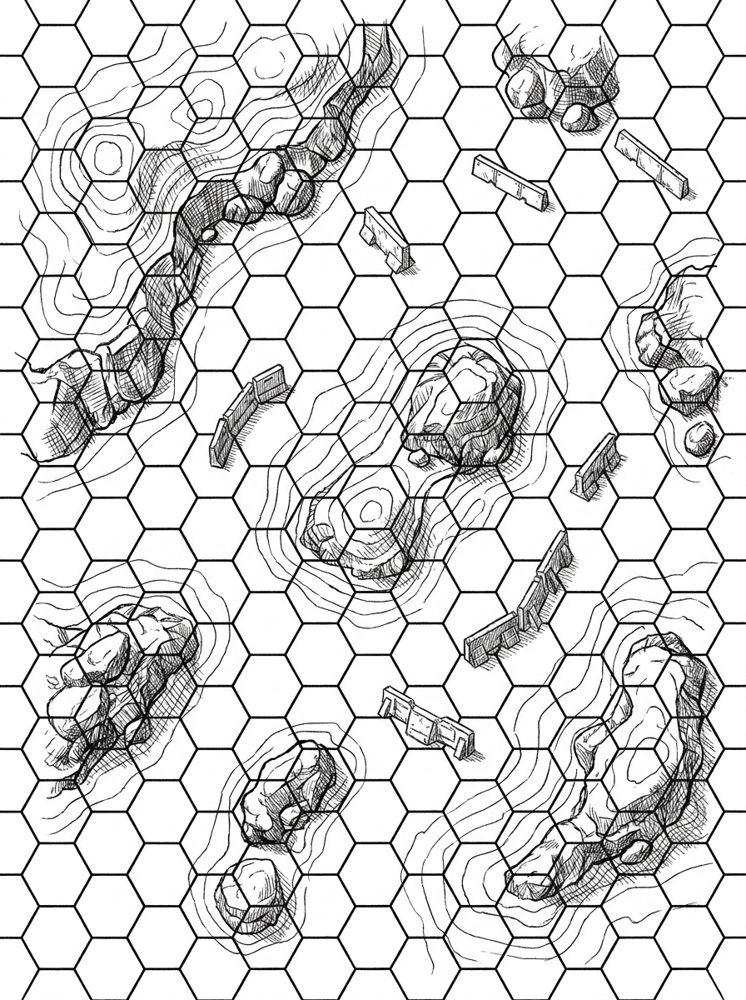

### 1.2 The Iron Frame Profile
Each Iron Frame (IF) is defined by its chassis, reactor, capacitor, and mounted components:
- **Initiative (2-12)**: A static value representing pilot reaction speed and chassis agility. Higher initiative frames shoot first but move last, while lower initiative frames move first but shoot last.
- **Chassis Mass (Tonnage)**: Built on a scale from **20 to 100 Tons** (typically in increments of 5). Tonnage determines the Frame's weight class and its corresponding **Mass Value** used for collision damage:
  - **Light** (20–35 Tons): Mass Value = 1
  - **Medium** (40–55 Tons): Mass Value = 2
  - **Heavy** (60–75 Tons): Mass Value = 3
  - **Assault** (80–100 Tons): Mass Value = 4
- **Reactor Rating**: The number of Energy Points (EP) generated by the Frame at the start of each turn.
- **Capacitor Max**: The maximum amount of unused EP that can be stored in the Capacitor between turns.
- **Evasion Limit**: The maximum Evasion Points (EVA) a Frame can accumulate through movement in a single turn.
- **Movement Limit**: The maximum number of hexes a Frame can enter (via walking, reversing, or jumping) in a single turn. This represents physical actuator limits at a 10-second scale:
  - **Light**: 6 hexes (approx. 65 km/h)
  - **Medium**: 5 hexes (approx. 54 km/h)
  - **Heavy**: 4 hexes (approx. 43 km/h)
  - **Assault**: 3 hexes (approx. 32 km/h)
  *(Pivoting/turning does not count toward the Movement Limit).*
- **Armor Damage Reduction (DR)**: Each of the 5 hit locations (**Head**, **Torso**, **Left Arm**, **Right Arm**, and **Legs**) has its own Armor DR rating. When a location is hit, its current Armor DR reduces incoming damage. If damage exceeds this DR (penetrates the armor), the remaining damage is applied to that location's Internal Structure, and the location's Armor DR is permanently reduced by 1.
- **Structural Integrity**: The maximum Internal Structure (IS) points for each of the 5 locations.
- **Mounted Weapons**: Weapons can only be mounted in the **Left Arm**, **Right Arm**, or **Torso**. The mounting location determines the weapon's Firing Arc (Left Arm = Left Side Arc, Right Arm = Right Side Arc, Torso = Forward Arc).

---

## 2. Turn Sequence
> *"A good plan violently executed now is better than a perfect plan executed next week." — George S. Patton*

Each round of play is divided into four distinct phases:
1. **Energy Phase**: Generate energy and allocate stealth/system upkeep.
2. **Activation Phase**: Move Frames and spend EP on movement in **reverse initiative order** (lowest initiative first).
3. **Combat Phase**: Declare and resolve attacks in **initiative order** (highest initiative first).
4. **End Phase**: Store unused energy, dissipate temporary effects, and clean up the board.

### 2.1 Energy Phase
At the start of the turn, players perform the following steps:
1. **Energy Generation**: Every Frame generates EP equal to its Reactor Rating. This is added to any EP currently stored in the Capacitor.
2. **Stealth & System Upkeep**: Players allocate EP to maintain active stealth or ECM systems (e.g., Active Metamaterial Coating, ECM). This EP is immediately deducted from the available pool. Any remaining EP is carried over to be spent dynamically on movement and combat.

### 2.2 Activation Phase (Reverse Initiative Order)
Frames activate one at a time, beginning with the **lowest Initiative** value and counting up.
- **Dynamic Movement Execution**: When a Frame activates, the player decides how to move it on the fly, spending EP from their current energy pool step-by-step. This allows players to react directly to the movements of previously activated (lower-initiative) frames.
- **Movement Limit**: A Frame cannot enter more hexes during its activation than its weight class **Movement Limit** (Light = 6, Medium = 5, Heavy = 4, Assault = 3). Changing Leg Facing (pivoting) does not count as entering a hex and is not restricted by this limit.
  - **Forward Walk (W)**: Move 1 hex forward. Cost: 1 EP.
  - **Reverse (R)**: Move 1 hex backward without changing facing. Cost: 2 EP.
  - **Pivot/Turn (TL/TR)**: Change facing by 60 degrees (one hexside) left or right. Cost: 1 EP.
  - **Jump Jet (J)**: Only available to **Light** and **Medium** weight classes (20–55 Tons). Heavy and Assault Frames cannot be equipped with Jump Jets and cannot jump.
    - *Cost*: 2 EP per hex.
    - *Movement*: The Frame jumps in a straight line to a hex within its maximum jump distance (default maximum of 4 hexes). It bypasses all intervening terrain, obstacles, and other Frames.
    - *Landing Mechanics*:
      - **Clear & Paved Landing**: Landing in a Clear or Paved hex is an **automatic clean landing**. Set Leg Facing for free.
      - **Hazardous & Feature Landing**: Landing in **Rough, Deep Water, Building Roofs, Light Woods, or Heavy Woods** requires a **Pilot Check (TN 6+)** upon touchdown:
        $$\text{Landing Check} = 2d6 + \text{Mass Value} + \text{Terrain Modifier}$$
        - *Success (6+)*: Clean landing! Set Leg Facing for free.
        - *Failure (< 6)*: The Frame stumbles and falls **Prone** in the landing hex. (If landing in Heavy Woods, the canopy impact also inflicts **1 point of Armor DR degradation** to the Torso).
      - **Kinetic Drop Strike**: Alternatively, a pilot may target an occupied hex to perform a Kinetic Drop Strike.
      - **Drop Strike Damage**: Both Frames suffer damage rolled using a pool of $d6$ dice:
        $$\text{Drop Strike Damage Dice} = (\text{Jumping Frame's Mass Value} \times \text{Hexes Jumped}) / 2 \text{ (rounded up)}$$
        - The target Frame suffers the full result in damage (e.g. 3d6 rolled as 1, 4, 6 = 11 damage).
        - The jumping Frame suffers half the result in damage (e.g. 11 / 2 = 6 damage).
        - Roll a 1d6 Hit Location for both the target and the jumper to determine where the damage lands.
        - Both damage hits are reduced by the respective location's Armor DR normally. Evasion (EVA) does not reduce Drop Strike damage.
      - **Displacement**: After damage is resolved, the target's player (the defender) slides the jumping Frame into any unoccupied adjacent hex of their choice. If no adjacent hex is unoccupied, the jumping Frame falls Prone, taking an additional 2d6 damage to its Legs, and is placed in the nearest unoccupied hex (see Section 6.3).
    - *Evasion*: Due to the high velocity and ballistic trajectory of flight, jumping generates **2 EVA per hex jumped** (up to the Frame's Evasion Limit).
- **Collisions & Blocking**: If a Frame's movement path would enter a hex occupied by another Frame, a collision occurs. The moving Frame immediately stops in the last unoccupied hex, its activation ends, and both frames suffer damage.
  - **Collision Damage**: Both the moving Frame and the stationary target Frame suffer damage to a random location determined by rolling on the Hit Location Table individually. Evasion (EVA) points do **not** reduce collision damage, as the impact is physical and unavoidable.
  - **Damage Calculation**: The damage is rolled using a pool of $d6$ dice based on the moving Frame's **Mass Value** (Light = 1, Medium = 2, Heavy = 3, Assault = 4) and its speed (the number of hexes moved in the current activation before impact):
    $$\text{Collision Damage Dice Pool} = \text{Mass Value} \times \text{Speed Factor}$$
    Where **Speed Factor** is the number of hexes moved in this activation prior to impact divided by 2 (rounded up, minimum of 1).
  - **Pilot Check**: After resolving collision damage, both Frames must check if they fall Prone (see Section 6.3).
- **Accumulating Evasion**: For every hex a Frame successfully exits during its activation *(changing facing/pivoting does not exit a hex and generates 0 EVA)*, it gains 1 **Evasion Point (EVA)**, up to its Evasion Limit. These EVA points are tracked using tokens and represent the difficulty of targeting a moving frame.
- **Torso Twist**: At the very end of its activation (after all movement is completed), the Frame may perform a free Torso Twist. The player can rotate the upper body of the Frame 1 hex side (60 degrees) to the left or right of its current Leg Facing, or reset it to align with the Leg Facing. This sets the Frame's Torso Facing (and Firing Arcs) for the upcoming Combat Phase. The torso remains in this position until the Frame activates in the next turn's Activation Phase.

#### 2.2.1 Movement Examples
- **Example 1 (Tactical Maneuvering)**: An IF-55M-1 "Vanguard" (Reactor 12) starts its activation on Level 0 with a full energy pool of 12 EP. 
  1. It performs a **Forward Walk** (1 EP) into an adjacent Level 1 Clear hex. (Cost: 1 EP + 1 EP climbing cost = 2 EP total).
  2. It performs a **Pivot/Turn** (1 EP) to rotate its Leg Facing 60 degrees left.
  3. It performs a **Forward Walk** (1 EP) into a Light Woods hex on Level 1. (Cost: 1 EP + 1 EP woods entry cost = 2 EP total).
  4. It performs a second **Forward Walk** (1 EP) through the woods on Level 1. (Cost: 1 EP + 1 EP woods entry cost = 2 EP total).
  - *EP Expenditure*: $2 + 1 + 2 + 2 = 7$ EP. The Vanguard has 5 EP remaining in its pool to spend on active systems or firing weapons during the Combat Phase.
  - *Evasion accumulated*: It exited 3 hexes during its movement, earning **3 EVA tokens** (well within its Evasion Limit of 4 EVA).
  - *Final Step*: The pilot performs a free **Torso Twist** 60 degrees right to point its torso-mounted guided missiles toward the target's expected location.

- **Example 2 (Jump Jet Cliff-Jumping)**: An IF-45M-1 "Specter" (Reactor 9, Capacitor 3, total 12 EP available) starts its activation at the base of a steep Level 2 cliff (Level 0 hex adjacent to a Level 2 hex).
  1. It declares a **Jump Jet** maneuver targeting an unoccupied Level 2 hex 3 spaces away, directly on top of the cliff (bypassing the steep height difference which blocks standard walking).
  - *EP Expenditure*: 3 hexes jumped $\times$ 2 EP = 6 EP. 
  - *Evasion accumulated*: Jumping generates 2 EVA per hex. 3 hexes $\times$ 2 = 6 EVA, which is capped at the Specter's Evasion Limit of **5 EVA**.
  - *Landing*: Upon landing, the pilot sets the Specter's Leg Facing toward the enemy's rear quadrant for free.
  - *Final Step*: The pilot leaves the torso aligned forward to keep its arm-mounted Disruptor Cannon pointed at the target. The Specter has 6 EP remaining to fire its weapons in the Combat Phase.

- **Example 3 (Water Cooling & Urban Cover)**: An IF-25L-1 "Jackal" (Base Reactor 8) starts its turn standing in a Shallow Water hex.
  1. **Energy Phase**: The water submerged legs cool the reactor, generating **+1 extra EP** (total energy pool = 9 EP).
  2. **Activation Phase**: The Jackal performs 2 **Forward Walks** (2 EP) out of the water into a Paved street hex (gaining 2 EVA).
  3. It performs a **Pivot** (1 EP) and a **Forward Walk** (1 EP) into a hex adjacent to a Level 2 **Urban Building** (gaining 3 total EVA).
  - *EP Expenditure*: $2 + 1 + 1 = 4$ EP. The Jackal has 5 EP remaining to fire its Autocannon or Laser.
  - *Defensive Status*: Positioned adjacent to the building, the Jackal gains **Heavy Cover (+2 EVA)** against incoming attacks crossing the building's hexside, boosting its effective Evasion from 3 EVA to **5 EVA**.

### 2.3 Combat Phase (Initiative Order)
Frames attack in order of **highest Initiative** to **lowest Initiative**.
- **Instant Resolution**: Unlike some tabletop games, damage is resolved *instantly*. If a high-initiative Frame destroys or disables a weapon on a lower-initiative Frame, that lower-initiative Frame cannot use that weapon when its turn to fire comes.
- **Attack Sequence**:
  1. **Select Weapon & Pay EP Cost**: Deduct the weapon's EP cost from the Frame's current pool. *(Note: If a Frame's EP pool was drained by an earlier attack and it can no longer afford a weapon's EP cost, it cannot fire that weapon this turn).*
  2. **Verify Line of Sight (LOS) and Arc**: The target must be within the weapon's firing arc (determined by the Torso Facing set at the end of the Activation Phase) and have clear LOS (unless using a weapon that permits indirect fire).
  3. **Verify Sensor Detection & Lock**: The target must be detected on a spectrum compatible with the weapon (Visual [VIS], Infrared [IR], or Microwave [Radar]). If the target is undetected on that spectrum, the attack cannot be declared.
  4. **Determine Hit Location**: Roll 2d6 on the **Hit Location Table**.
  5. **Roll Damage**: Roll the weapon's damage dice.
  6. **Apply Target Evasion**: Subtract the target's current EVA points from the rolled damage. *(Note: EVA points are not spent when attacked; the target's full EVA value applies to every single attack made against it this turn).*
  7. **Apply Armor DR**: Subtract the target location's current Armor DR from the remaining damage.
  8. **Resolve Damage & Armor Degradation**: 
     - If the remaining damage is **greater than 0**, the excess damage is deducted directly from that location's **Internal Structure**. Additionally, because the armor was penetrated, the Armor DR of that location is permanently **reduced by 1** (to a minimum of 0).
     - If the remaining damage is **0 or less**, the armor successfully blocks the hit; the location suffers no damage, and its Armor DR does not degrade.
  9. **Roll Critical Hits**: If the location's Internal Structure takes 1 or more points of damage, roll 1d6 on the **Critical Hit Table** for that location.

#### 2.3.1 Combat Examples
- **Example 1 (Direct Laser Fire & Critical Hit)**: During the Combat Phase, the IF-90A-1 "Colossus" (Initiative 3) resolves its attack against the IF-55M-1 "Vanguard" (Initiative 6).
  1. **Weapon Selection**: The Colossus pilot spends 4 EP to fire the **Thermal Lance** mounted on its Left Arm.
  2. **Verify Arc and LOS**: The Vanguard is located within the Colossus's Left Side Arc (Left Arm mount). Line of Sight is clear of blocking terrain.
  3. **Verify Lock**: The Colossus has a Visual (VIS) lock on the Vanguard.
  4. **Hit Location**: The Colossus rolls 2d6 on the Hit Location Table. The attack came from the Front Hit Zone, so the Front/Rear column is used. The roll is a 7, indicating a **Torso** hit.
  5. **Roll Damage**: The Colossus rolls 3d6 for the Thermal Lance: rolls a total of 12 damage.
  6. **Apply Target Evasion**: The Vanguard has 3 EVA tokens. Subtract 3 from damage: $12 - 3 = 9$ damage remaining.
  7. **Apply Armor DR**: The Vanguard's Torso currently has an Armor DR of 5. Subtract 5 from damage: $9 - 5 = 4$ damage remaining.
  8. **Resolve Damage & Degradation**: 
     - The remaining 4 damage penetrates the armor and is deducted directly from the Vanguard's Torso Internal Structure (reducing it from 12 to 8).
     - Because the armor was penetrated, the Vanguard's Torso Armor DR is permanently **reduced by 1** (from 5 to 4).
  9. **Roll Critical Hit**: Since the Torso Internal Structure suffered damage, the Colossus rolls 1d6 on the Torso Critical Hit Table: rolls a 3, indicating **Reactor Damage** (the Vanguard's reactor output is permanently reduced by 2 EP per turn).

### 2.4 End Phase
- **Energy Storage**: Unused EP is moved to the Capacitor, up to the Capacitor Max. Any excess EP is vented and lost.
- **Clean Up**: Remove Evasion tokens, decrement cooldown tokens on weapons, and reduce the value of any Smoke tokens by 1 (remove the smoke template entirely when its token reaches 0).

---

## 3. Terrain & Elevation
> *"The terrain is the foundation of victory. Know the ground, know the weather; your victory will then be total." — Sun Tzu*

Combat under the Iron Protocol occurs across diverse Earth battlefields and containment sectors. The map's hexes are classified by terrain type, which alters movement costs, provides cover, or impacts pilot checks.

### 3.1 Summary of Terrain Types

| Terrain Type | Extra EP Cost | Defensive Cover | Special Rules |
| :--- | :---: | :--- | :--- |
| **Clear** | +0 EP | None | Standard terrain. |
| **Paved** | +0 EP | None | High traction surface. **+1 bonus** to all Pilot Checks. |
| **Rough** | +1 EP | None | Uneven footing. **-1 penalty** to all Pilot Checks. |
| **Water (Shallow)** | +1 EP | None | Knee-deep liquid. Evasion capped at **2 EVA**. Generates **+1 EP** in Energy Phase. |
| **Water (Deep)** | +2 EP | None | Waist-deep liquid. Evasion capped at **1 EVA**. **-1 penalty** to Pilot Checks. Generates **+2 EP** in Energy Phase. |
| **Woods (Light)** | +1 EP | Light Cover (+1 EVA) | Sparse trees. Blocks VIS locks if 2+ hexes intervene. |
| **Woods (Heavy)** | +2 EP | Heavy Cover (+2 EVA) | Dense forest. Blocks VIS locks if 1+ hexes; blocks IR if 3+ hexes. **Impassable to Heavy/Assault Frames on foot.** |
| **Urban (Building)** | Impassable (Ground) | Solid Barrier | Structures block all locks (VIS/IR/Radar) up to height. Heavy Cover (+2 EVA) if adjacent. |

---

### 3.2 Movement & Elevation Rules
The battlefield is three-dimensional, divided into vertical **Levels** (Level 0 is default ground level; each level = **6 meters**). All Iron Frames are **2 levels tall** (12 meters), occupying vertical space from Level X to Level X + 2.

#### Chassis Bulk & Forest Restrictions
Due to their immense physical scale and bulk:
- **Light (20–35T)** and **Medium (40–55T)** Frames may maneuver through Heavy Woods normally (+2 EP entry cost).
- **Heavy (60–75T)** and **Assault (80–100T)** Frames **cannot walk or reverse into Heavy Woods hexes** on foot. *(Exception: Heavy and Assault Frames equipped with Jump Jets may jump over or overtop Heavy Woods hexes).*

#### Elevation Movement Table

| Elevation Change | EP Cost | Movement & Fall Rules |
| :--- | :---: | :--- |
| **Same Level (0)** | Base Terrain Cost | Standard movement. |
| **Climbing Up (+1 Level)** | Terrain Cost + **1 EP** | Step up onto 1 level higher terrain. |
| **Climbing Down (-1 Level)** | Base Terrain Cost | Step down onto 1 level lower terrain (+0 extra EP). |
| **Steep Cliff ($\ge$ 2 Levels)** | Impassable on foot | Cannot walk or reverse. Must use **Jump Jets** to traverse. |
| **Forced Fall ($\ge$ 2 Levels)** | — | Frame falls **Prone** on landing. Takes **1d6 damage per level fell** to a random location. |

#### Jump Jet Terrain Landing Table

| Landing Location | Pilot Check (TN 6+)? | Terrain Modifier | Failure Effect (< 6) |
| :--- | :---: | :---: | :--- |
| **Clear / Paved** | **No** (Automatic) | +0 (Clear) / +1 (Paved) | Clean landing. |
| **Rough Terrain** | **Yes** | **-1** | Falls **Prone** in landing hex. |
| **Water (Deep)** | **Yes** | **-1** | Falls **Prone** in water. |
| **Building Roof** | **Yes** | **-1** | Falls **Prone** on roof. |
| **Light Woods** | **Yes** | **-1** | Falls **Prone** in canopy. |
| **Heavy Woods** *(Light/Med only)* | **Yes** | **-2** | Falls **Prone** + 1 Torso Armor DR loss. |

---

### 3.3 Hard Cover vs. Concealment (Sensors & Locks)

Understanding the distinction between **Hard Cover** (which reduces damage when targeted) and **Concealment** (which prevents sensor locks entirely) is vital to tactical survival.

#### 1. Hard Cover (Defensive Damage Reduction)
Hard cover represents physical obstacles that absorb kinetic energy or diffuse beam weapons when a Frame is targeted:
- **Light Cover (+1 EVA)**: Standing in **Light Woods** adds a temporary **+1 EVA** bonus to the target's current Evasion value when resolving incoming damage.
- **Heavy Cover (+2 EVA)**: Standing in **Heavy Woods** or standing **adjacent to an Urban Building** (when Line of Sight crosses the building's hexside) adds a temporary **+2 EVA** bonus to the target's Evasion value.

#### 2. Concealment & Sensor Lock Blockage (Spectrum Matrix)
If an intervening terrain feature blocks Line of Sight on a specific sensor spectrum, a Frame **cannot declare an attack** using a weapon that requires that spectrum.

| Intervening Terrain Feature | Visual (VIS) Lock | Infrared (IR) Lock | Microwave (Radar) Lock |
| :--- | :---: | :---: | :---: |
| **Light Woods (1 hex)** | Clear | Clear | Clear |
| **Light Woods (2+ hexes)** | **BLOCKED** | Clear | Clear |
| **Heavy Woods (1+ hexes)** | **BLOCKED** | Clear | Clear |
| **Heavy Woods (3+ hexes)** | **BLOCKED** | **BLOCKED** | Clear |
| **Urban Building (Any)** | **BLOCKED** | **BLOCKED** | **BLOCKED** |
| **Smoke Template** | **BLOCKED** | Clear | Clear |
| **Elevation / Hill ($\ge$ Top Height)** | **BLOCKED** | **BLOCKED** | **BLOCKED** |

#### Summary of Foliage & Vegetation Blockage:
- **Light Woods**: Requires **2 or more intervening hexes** to block Visual (VIS) locks. Does not block IR or Radar.
- **Heavy Woods**: A single **1 intervening hex** is sufficient to completely block Visual (VIS) locks. Requires **3 or more intervening hexes** to absorb and block Infrared (IR) thermal locks. Does not block Radar.

---

### 3.4 Line of Sight (LOS) & Elevation Height Math

Line of Sight (LOS) between an Attacker (standing on Level A, top height $A+2$) and a Target (standing on Level B, top height $B+2$) is checked against all intervening hexes.

#### 1. Terrain & Elevation LOS Formula
An intervening hex of elevation level $Y$ or building height $Y$ blocks **all** sensor locks (VIS, IR, Radar) if:
$$\text{LOS Blocked if } Y \ge \min(A + 2, B + 2)$$
*(Example: Two Frames on Level 0 [top height 2] can see over a Level 1 hill [height 1]. A Level 2 hill [height 2] blocks Line of Sight completely).*

#### 2. Vegetation Canopy Height (Visual LOS Only)
Trees have vertical foliage that adds to ground level for **Visual (VIS)** LOS only. IR and Radar sensors ignore canopy height:
- **Light Woods Canopy**: Adds **+1 Level** of Visual obstruction height (e.g., Level 0 Light Woods = VIS height 1).
- **Heavy Woods Canopy**: Adds **+2 Levels** of Visual obstruction height (e.g., Level 0 Heavy Woods = VIS height 2).

---

### 3.5 Pilot Checks & Water Cooling

#### 1. Terrain Pilot Check Adjustments
Apply the standing hex's terrain modifier to all **Pilot Check** rolls (collision recovery, Drop Strike landing):
- **Paved**: **+1 bonus** to Pilot Checks (high traction).
- **Rough**: **-1 penalty** to Pilot Checks (uneven footing).
- **Water (Deep)**: **-1 penalty** to Pilot Checks (water drag).

#### 2. Environmental Cooling (Water)
Standing in liquid provides passive cooling to an Iron Frame's reactor during the **Energy Phase**:
- **Water (Shallow)**: Generates **+1 extra EP** during the Energy Phase. Evasion Limit is capped at **2 EVA**.
- **Water (Deep)**: Generates **+2 extra EP** during the Energy Phase (extreme submerged cooling). Entry costs **+2 EP**, Evasion Limit is capped at **1 EVA**, and Pilot Checks take a **-1 penalty**.

---

## 4. Sensors, Stealth, and Detection
> *"All warfare is based on deception." — Sun Tzu*

Because attacks hit automatically if targeted, the tactical battle is won or lost in the **Sensor & Detection** game. A Frame cannot be attacked unless it is detected on at least one sensor spectrum required by the weapon.

### 4.1 The Sensor Suite (Head Location)
Every Frame has a sensor suite consisting of three bands, housed in the Head location, arranged here in order of increasing electromagnetic wavelength:
1. **Visual (VIS)**: Shortest wavelength (approx. 380–700 nm). Housed in high-resolution optical cameras.
   - *Requires*: Direct Line of Sight (blocked by Elevation normally). To lock a target hidden behind solid Elevation, a Frame must receive telemetry via a **Tactical Datalink** from a friendly spotter with clear VIS LOS.
   - *Blocked by*: Smoke templates, heavy forests, or Visual-Camouflage (VIS) AMC.
2. **Infrared (IR)**: Medium wavelength (approx. 700 nm–1 mm). Thermal sensors detecting heat signatures.
   - *Requires*: Direct Line of Sight (blocked by Elevation normally), but entirely ignores Woods and Smoke penalties. To lock a target hidden behind solid Elevation, a Frame must receive telemetry via a **Tactical Datalink** from a friendly spotter with clear IR LOS.
   - *Sensitivity*: Targets become visible and targetable on IR for the remainder of the turn the moment they spend their **5th EP** of the turn (cumulatively across the Energy, Activation, or Combat phases).
   - *Blocked by*: Flares or Infrared-Suppression (IR) AMC.
3. **Microwave (Radar)**: Longest wavelength (approx. 1 mm–1 m). Active microwave radio detection.
   - *Requires*: Direct Line of Sight (blocked by Elevation normally), but entirely ignores Woods and Smoke penalties. To lock a target hidden behind solid Elevation, a Frame must receive telemetry via a **Tactical Datalink** from a friendly spotter with clear Radar LOS.
   - *Blocked by*: Active ECM, Microwave-Absorbent (Radar) AMC, or solid Elevation (Hills/Mountains).

### 4.2 Stealth & Defensive Countermeasures
Frames can run active systems to deny locks and hide from sensors:
- **Electronic Countermeasures (ECM)**: Costs **1 EP** to activate in the Energy Phase. Blocks Microwave (Radar) detection and locks on the host Frame (0-hex radius). **Overcharge** [+1 EP per +1 hex radius]. All friendly Frames within the active radius are protected. *(Note: Overcharging triggers the mandatory 1-Turn Cooldown on the ECM suite).*
- **Flares**: Limited charges (typically 3). When targeted by an IR-guided missile or IR-based attack, the defender may expend 1 Flare charge to completely negate the attack.
- **Smoke Launchers**: Limited charges (typically 2). During the Activation Phase, a Frame may spend 1 EP and 1 charge to deploy a Smoke cloud in its current or an adjacent hex (place a Smoke token with a value of 2). The smoke template blocks Visual (VIS) LOS and Visual locks through that hex for as long as it remains on the board. Infrared (IR) and Microwave (Radar) sensors are unaffected and can scan through smoke unimpeded.
- **Active Metamaterial Coating (AMC)**: Costs **2 EP** to activate in the Energy Phase. The Frame tunes its coating to absorb **one** sensor spectrum (Microwave, IR, or VIS), preventing it from being detected or locked on that spectrum. **Overcharge**: [+2 EP to cloak a 2nd spectrum simultaneously]. *(Note: Overcharging triggers the mandatory 1-Turn Cooldown, meaning the AMC will be completely offline during the following round, leaving the Frame fully exposed on all spectrums).*
- **Pre-Combat System Deployment**: At the start of a battle (during Deployment), Frames equipped with **AMC** or **ECM** may choose to deploy with those systems **Active**. The system's base upkeep cost (2 EP for AMC, 1 EP for ECM) is automatically deducted from the Frame's generated energy pool during the Round 1 Energy Phase.

### 4.3 Tactical Datalink (Head Location)
A Frame may be equipped with a **Tactical Datalink** housed in its Head location.
- **Shared Targeting Data**: If two or more friendly Frames on a team are equipped with active Tactical Datalinks, they share sensor data in real time. If a target is detected or locked on any sensor spectrum (Visual, Infrared, or Microwave) by *one* of the datalinked Frames, it is instantly considered detected/locked on that spectrum for *all* other active datalinked Frames on the team.
- **Critical Failure**: If a Frame suffers a **Comm Static** critical hit to its Head (Sensors) location, or is affected by an EMP warhead, its Tactical Datalink is disabled for the rest of the battle (or until the EMP effect clears), immediately severing that Frame from the shared sensor network.

---

## 5. Weapons & Munitions
> *"God is on the side with the best artillery." — Napoleon Bonaparte*

Weapons can only be mounted in the Left Arm, Right Arm, or Torso, which dictates their firing arcs (see Section 1.1).

- **Armor Piercing (AP X)**: Weapons or munitions designated as **AP X** ignore up to **X** points of the target's Armor DR when calculating damage. (For example, an AP 3 weapon fired at a location with Armor DR 5 treats that location's DR as 2).

- **Area of Effect (AoE)**: Damage designated as **AoE** (such as Missile Cluster and Splash damage) blankets a wide area and completely bypasses Evasion. Do not subtract the target's EVA points from AoE damage rolls.

- **Rapid Fire**: Weapons with this trait fire in bursts. When firing a Rapid Fire weapon, the target's Evasion (EVA) reduces the *number of hits* (one hit misses entirely per EVA point) rather than subtracting from the total damage. Rapid Fire weapons can be fired in two modes:
  - **Single Burst (Base EP Cost)**: Consumes 1 Burst of ammo. Roll 1 Hit Location. Roll the weapon's burst damage dice (e.g., 3x 1d6) and resolve each die against the target location's Armor DR separately.
  - **Full Auto (X $\times$ Base EP)**: Consumes X Bursts of ammo (up to the magazine limit), paying the base EP cost for each burst. Roll 1 Hit Location. Roll the damage dice for *all* bursts combined against that location, resolving each separately. Evasion reduces the total number of hits across the entire barrage.

| Weapon | HP | EP Cost | Ammo | Cooldown | Damage | Detection | Traits | Special Rules |
| :--- | :---: | :---: | :---: | :---: | :---: | :---: | :---: | :--- |
| **Autocannon** | Light | 1/burst | 10 Bursts (Explosive) | None | 3x 1d6 (Burst) | Any | Rapid Fire | Fires 3-round bursts. Each 1d6 resolved separately. Can fire Full Auto. |
| **Laser** | Light | 2 | Infinite | None | 2d6 | Any | Overcharge | **Overcharge**: [+1/+2 EP for +2/+4 flat damage]. |
| **Guided Missiles** | Medium | 2 | 4 Salvos (Explosive) | None | Warhead Dep. | Guidance Dep. | AoE | Requires Lock. Permits indirect fire (no LOS) for all guidance types. |
| **Disruptor Cannon** | Medium | 3 | Infinite | None | None | Any | Bypasses Evasion, Overcharge | Bypasses Armor DR (see sheet for hit effects). **Overcharge**: [+2 EP to force Crit AND drain 1d6 EP simultaneously]. |
| **Thermal Lance** | Heavy | 4 | Infinite | None | 3d6 | Any | Overcharge | **Overcharge**: [+2/+4 EP for +3/+6 flat damage]. |
| **Rail Gun** | Heavy | 0 | 5 Slugs (Inert) | None | 3d6 + 10 | Any | AP 3, Overcharge | Inert slugs. **Requires Overcharge to fire**: [+6 EP]. |

### 5.1 Autocannon Munitions
When equipping an Autocannon, players choose how to load its 10-Burst ammunition supply. An Autocannon's magazine feed can hold up to **two** distinct ammo types chosen from the three available options (AP, HEI, or Tracers) at build time. Players may load all 10 Bursts with a single ammo type or split the 10 Bursts between two selected types (e.g., 5 AP / 5 Tracers, or 7 HEI / 3 Tracers), declaring which type is being fired before rolling to hit.
- **Armor Piercing (AP 1)**: Ignores up to 1 point of the target's Armor DR per hit.
- **High Explosive Incendiary (HEI)**: Adds a flat +1 modifier to any Critical Hit rolls caused by this weapon.
- **Tracer Rounds (Target Marking)**: Apply a **-1 damage penalty** to every 1d6 damage die rolled for the weapon (minimum 0 damage per die). However, if even a single tracer round hits the target (i.e., is not negated by Evasion), the target becomes "Painted". All subsequent attacks from *any friendly Frame (including the attacker)* ignore 1 point of the target's Evasion (EVA) for the rest of the Combat Phase.

### 5.2 Guided Missile Systems
Missiles must be configured with a guidance package and a warhead at build time:
- **Guidance Systems**:
  - *Microwave (Radar)-Guided*: Permits indirect fire (ignoring Elevation/LOS blocks). Requires a Microwave (Radar) lock (which must be provided by a Tactical Datalink spotter if the firing Frame lacks direct LOS). Blocked by active ECM or Microwave-Absorbent Active Coating.
  - *Infrared (IR)-Guided*: Permits indirect fire (ignoring Elevation/LOS blocks). Requires an Infrared (IR) lock (which must be provided by a Tactical Datalink spotter if the firing Frame lacks direct LOS). Target must have spent 5+ EP this turn. Blocked by Flares or Infrared-Suppression Active Coating.
  - *Visual (VIS)-Guided*: Permits indirect fire (ignoring Elevation/LOS blocks, utilizing onboard optical cameras during terminal descent). Requires a Visual (VIS) lock (which must be provided by a Tactical Datalink spotter if the firing Frame lacks direct LOS). Blocked by Smoke or Visual-Camouflage Active Coating.
- **Warheads**:
  - *High Explosive (HE)*: Roll 1 Hit Location. Deals 3d6 damage to the primary hit location, and **1d6 splash damage** to all adjacent locations on the target Frame (e.g., if the Torso is hit, the Head, Arms, and Legs take splash damage).
  - *Cluster*: Sandblasts the target's entire chassis. Deals **2d6 damage** (combined) to *every location* on the target Frame (Head, Torso, Left Arm, Right Arm, Left Leg, Right Leg). Resolve this 2d6 damage once against each location's Armor DR.
  - *EMP (Electromagnetic Pulse)*: Detonates in a massive sphere. Targets a specific hex rather than a single Frame. **All Frames** within the target hex and the 6 surrounding adjacent hexes suffer the EMP effect. Deals no physical damage. Bypasses Armor DR. Affected Frames suffer heavily scrambled sensors for the next turn (must pass a Pilot Check to establish any sensor locks). Additionally, any affected Frame suffers a **Critical Hit** on *every* location that currently has **0 Armor DR** (roll on the Critical Hit table for each exposed location). *(Note: This affects friendly Frames caught in the blast radius).*

### 5.3 Extra Ammunition Bins
Ballistic and Missile weapons come with a standard internal magazine included in their base Hardpoint cost (e.g., the Autocannon includes 10 bursts). If a player wishes to carry additional ammunition for sustained fire, they may mount **Extra Ammo Bins**. **Extra Ammo Bins may only be mounted in the Torso.**
- **Extra Ammo Bin (Autocannon)**: Grants +10 Bursts. Occupies 1 Light Hardpoint (Torso only).
- **Extra Ammo Bin (Guided Missiles)**: Grants +4 Salvos. Occupies 1 Medium Hardpoint (Torso only).
- **Extra Ammo Bin (Rail Gun)**: Grants +5 Slugs. Occupies 1 Heavy Hardpoint (Torso only).

*(Note: Because Extra Ammo Bins can only be mounted in the Torso, they remain susceptible to the Ammo Explosion result on the Torso Critical Hit Table).*

### 5.4 Universal System Traits
Many weapons and utility systems share standardized mechanical behaviors, represented by keywords or Traits.

> **Trait: Overcharge [Cost for Effect]**
> Any weapon or system with the Overcharge trait allows a pilot to dump excess EP from their Capacitor beyond the base activation cost to achieve a magnified effect. 
> * **Capacitor Drain**: The additional EP required to trigger an Overcharge must be paid *exclusively* from banked EP in the Frame's Capacitor. Freshly generated Reactor EP cannot be used to pay Overcharge costs.
> * **Overcharge**: High-yield energy weapons (Lasers, Thermal Lances, Disruptor Cannons, Rail Guns) allow a pilot to dump additional EP from the Capacitor during the Combat Phase to boost damage or induce special effects. Overcharging a weapon triggers a **1-Turn Cooldown** on that weapon.
> *(Example: A pilot overcharges their Thermal Lance. They spend 4 base EP + 4 overcharge EP = 8 EP total, dealing **3d6 + 6 damage** instead of the usual 3d6. The weapon then enters a 1-Turn Cooldown and cannot be fired next round).*

---

## 6. Damage & Critical Hits
> *"No plan of operations extends with any certainty beyond the first contact with the main hostile force." — Helmuth von Moltke the Elder*

### 6.1 Hit Location Table (2d6)
When a Frame is hit, the player rolls 2d6 and determines the hit location using the column corresponding to the incoming attack's **Hit Zone** (Left Side, Front/Rear, or Right Side):

| Roll (2d6) | Left Side Attack | Front / Rear Attack | Right Side Attack |
| :---: | :--- | :--- | :--- |
| **2** | Torso (Core Critical)* | Torso (Core Critical)* | Torso (Core Critical)* |
| **3** | Left Leg | Right Arm | Right Leg |
| **4** | Left Arm | Right Arm | Right Arm |
| **5** | Left Arm | Right Leg | Right Arm |
| **6** | Left Leg | Torso | Right Leg |
| **7** | Torso | Torso | Torso |
| **8** | Torso | Torso | Torso |
| **9** | Torso | Left Leg | Torso |
| **10** | Right Arm | Left Arm | Left Arm |
| **11** | Right Leg | Left Arm | Left Leg |
| **12** | Head (Sensors)** | Head (Sensors)** | Head (Sensors)** |

*\*Torso (Core Critical): Bypasses Torso Armor DR entirely (treat DR as 0 for this attack). Damage is dealt directly to Torso Internal Structure, and Torso DR is permanently reduced by 1.*  
*\*\*Head (Sensors): Contains the cockpit and Sensor Suite. Critical hits on the Head are highly dangerous and can stun or blind the Frame.*

### 6.2 Critical Hit Tables (1d6)
If damage penetrates to the **Internal Structure** of a location, roll 1d6 on the corresponding table. (Remember: HEI ammo adds a flat +1 modifier to these rolls, up to a maximum of 7. For rolls of 7+, resolve the 6 effect).

#### Head (Cockpit) Critical Table
- **1: Sensor Flicker**. Sensors are unstable. The Frame's sensor locks (VIS/IR/Radar) are capped at a maximum range of 5 hexes next turn.
- **2: Comm Static**. Tactical Datalink is disabled for the rest of the battle.
- **3: Pilot Stunned**. The Frame generates 0 EP next turn and its Capacitor is drained to 0 (cannot move, fire, or maintain active systems).
- **4: Sensor Array Destroyed**. Radar/IR locks disabled. Target is blind beyond adjacent hexes.
- **5: Cockpit Breach**. Pilot suffers toxic/pressure venting. Initiative is permanently reduced by 3.
- **6+: Pilot K.O. / Frame Shutdown**. The Frame is permanently disabled and out of combat.

#### Torso (Core) Critical Table
- **1: System Glitch**. The Frame generates 1 less EP next turn.
- **2: Capacitor Leak**. Capacitor Max is permanently reduced by 2; lose 2 stored EP immediately.
- **3: Reactor Damage**. Reactor output is permanently reduced by 2 EP per turn.
- **4: Gyro Lock**. Torso twists cost 2 EP (no longer free).
- **5: Ammo Explosion**. If the Frame carries **explosive ammunition** (Autocannon shells or Guided Missile warheads), it detonates for 3d6 damage to the Torso (bypassing armor). Inert ammunition (Rail Gun slugs) and energy weapons (Lasers, Thermal Lances, Disruptors) do **not** trigger this effect. If the Frame carries no explosive ammunition, treat as Reactor Damage instead.
- **6+: Core Melt**. The Reactor explodes. Deal 2d6 damage to all adjacent hexes, and the Frame is destroyed immediately.

#### Arms (Weapons & Actuators) Critical Table
- **1: Weapon Calibration Error**. Weapons mounted in this arm cost +1 EP to fire.
- **2: Weapon Damaged**. The attacking player chooses one weapon mounted in this arm; it is destroyed.
- **3: Shoulder Joint Jammed**. Weapons mounted in this arm can only fire into the Forward Arc.
- **4: Structural Fracture**. Arm Armor DR is permanently reduced to 0.
- **5: Ammo Feed Cut**. Ammunition-dependent weapons mounted in this arm are disabled.
- **6+: Arm Severed**. The arm is completely destroyed. All weapons and systems mounted in this arm are lost.

#### Legs (Mobility) Critical Table
- **1: Toe Actuator**. -1 penalty to all future Pilot Checks.
- **2: Knee Lock**. Walking and reversing cost +1 EP per hex.
- **3: Hip Actuator**. Evasion Limit is permanently reduced by 1.
- **4: Structural Fracture**. Leg Armor DR is permanently reduced to 0.
- **5: Thruster Wrecked**. Jump Jets are disabled.
- **6+: Leg Severed**. The Frame falls Prone and is permanently immobilized. It cannot walk or reverse, and can only pivot (costing 3 EP per 60 degrees).

### 6.3 Falling and the Prone State
When an Iron Frame is knocked over during combat (via collision, Drop Strike, or leg destruction), it enters the **Prone** state. Mark the Frame with a Prone token.

### 6.4 Pilot Checks
A Frame must make a **Pilot Check** (rolling 2d6, target 6 or higher) in the following situations:
- **Avoiding Falling Prone**:
  - *Collisions*: (See Section 2.2 for Collision rules).
  - *Kinetic Drop Strike*: The **Target Frame** is automatically knocked Prone. The **Jumping Frame** must make a Pilot Check upon landing. $\text{Check} = 2d6 + \text{Mass} - \text{Hexes Jumped} + \text{Pilot Bonus}$.
  - *Leg Severed*: A Frame automatically falls Prone if a leg is severed (no check allowed).
- **Fighting Through Sensor Scrambles**:
  - *EMP Recovery*: If a Frame's sensors are scrambled by an EMP, the pilot must pass a Pilot Check (2d6) to establish a VIS, IR, or Radar lock. Failure means the lock cannot be established.

#### Effects of the Prone State
- **Defense**: A Prone Frame's movement-generated Evasion (EVA) is reduced to **0**, and it cannot generate new EVA. It still benefits from any temporary EVA modifiers granted by Terrain Cover.
- **Combat**: A Prone Frame cannot torso twist and suffers a **-1d6 penalty to all weapon damage rolls** (minimum of 1d6 rolled).
- **Maneuvering**: A Prone Frame cannot walk, reverse, or jump. Its only movement options are:
  - **Stand Up**: Costs **3 EP** during its Activation Phase. Upon standing, the pilot removes the Prone token and may set the Leg Facing to any direction for free.
  - **Pivot**: While Prone, the Frame may crawl-turn, pivoting its Leg Facing by 60 degrees. Cost: **2 EP** per 60 degrees.

### 6.5 Location Destruction & Damage Transfer
If the damage applied to a hit location reduces its remaining Internal Structure (IS) to 0, that location is destroyed. Any excess damage from that hit, as well as any subsequent hits to that location, are handled using the following rules:

#### 6.5.1 Torso Destruction
If the Torso's Internal Structure is reduced to 0, the engine core is breached. The Frame is completely destroyed.
*   **Core Melt**: The reactor explodes immediately. All units in adjacent hexes suffer **2d6 damage** (apply Evasion and Armor DR normally).

#### 6.5.2 Head Destruction
If the Head's Internal Structure is reduced to 0, the cockpit is vaporized or crushed, and the pilot is killed. The Frame is immediately deactivated and treated as destroyed.

#### 6.5.3 Arm Destruction (Left or Right)
If an Arm's Internal Structure is reduced to 0, the arm is severed and blown off.
*   **Equipment Loss**: All weapons and systems mounted in that arm are permanently destroyed and lost.
*   **Excess Damage**: Any excess damage from the hit that destroyed the arm bypasses Evasion and Armor DR, transferring directly to the **Torso** Internal Structure.

#### 6.5.4 Leg Destruction (Left or Right)
If a Leg's Internal Structure is reduced to 0, the leg is severed and blown off.
*   **Immediate Fall**: The Frame immediately falls **Prone**.
*   **Crippled Movement**: The Frame is permanently crippled and cannot walk, reverse, or jump. Its only movement option is to pivot its Leg Facing at a cost of **3 EP** per 60 degrees.
*   **Double Leg Loss**: If both legs are destroyed, the Frame is completely disabled (treated as destroyed).
*   **Excess Damage**: Any excess damage from the hit that destroyed the leg bypasses Evasion and Armor DR, transferring directly to the **Torso** Internal Structure.

#### 6.5.5 Damage Transfer (Blow-Through)
If an attack hits a location that has already been destroyed (e.g. a random hit location rolls a severed Arm or Leg), the hit is not wasted:
*   The damage bypasses Evasion and Armor DR, transferring directly to the **Torso** Internal Structure.
*   Damage cannot transfer further than the Torso (as Torso destruction destroys the Frame).

---

## 7. Optional Rules
> *"Amateurs talk about tactics, but professionals study logistics." — Gen. Robert H. Barrow*

For players seeking advanced simulation, competitive matching, or campaign settings, these optional rules introduce points-based force organization and environmental hazards.

### 7.1 Force Organization & Point Limits
To build balanced forces for casual or competitive play, players agree on a maximum **Deployment Point** limit (typically 1000 or 1500 points). Forces are organized into tactical groups:
- **Element**: A pair of 2 Iron Frames. (Standard skirmish games are typically 1 Element vs. 1 Element).
- **Platoon**: A full combat unit consisting of 3 to 4 Iron Frames (typically organized as two Elements operating together). 

### 7.2 Base Chassis & Custom Frames
If players wish to construct custom Iron Frames from scratch instead of using the pre-generated technical readouts (like the Vanguard or Specter), they must purchase a **Base Chassis** and spend points to upgrade it. 

Every Frame is defined by its physical **Tonnage** (Weight Class). Tonnage determines the Frame's starting baseline stats and its absolute maximum limits (**Limits**).

**Chassis Limits Table:**

| Chassis Class | Tonnage | Hardpoints (L / M / H) | Base Stats (Init / Move / EVA / Reactor / Capacitor) | Maximum Mobility Limits (Init / Move / EVA) | Base Cost |
| :--- | :---: | :---: | :--- | :--- | :--- |
| **Light** | 20–35 Tons | 4L / 0M / 0H | Init 8 \| Move 5 \| 4 EVA \| Reactor 6 \| Capacitor 2 | Init 12 \| Move 7 \| 6 EVA | 150 pts |
| **Medium** | 40–55 Tons | 4L / 2M / 0H | Init 6 \| Move 4 \| 3 EVA \| Reactor 6 \| Capacitor 2 | Init 10 \| Move 5 \| 5 EVA | 200 pts |
| **Heavy** | 60–75 Tons | 4L / 3M / 1H | Init 4 \| Move 3 \| 1 EVA \| Reactor 5 \| Capacitor 2 | Init 6 \| Move 4 \| 2 EVA | 250 pts |
| **Assault** | 80–100 Tons | 4L / 3M / 2H | Init 2 \| Move 2 \| 0 EVA \| Reactor 5 \| Capacitor 2 | Init 4 \| Move 3 \| 1 EVA | 300 pts |

*Note: Every Frame possesses a specific number of hardpoints dictating what equipment it can mount. A Frame cannot mount a piece of equipment heavier than its weight class.*

#### 7.2.1 Base Armor DR & Internal Structure (IS)
When purchasing a Base Chassis, it comes pre-equipped with standard baseline **Internal Structure (IS)** and **Base Armor Damage Reduction (DR)** scaled to its physical Weight Class. Internal Structure is determined strictly by Tonnage and cannot be upgraded.

**Base Internal Structure (IS) & Armor DR Table:**

| Chassis Class | Head (IS / DR) | Torso (IS / DR) | Arms [L/R] (IS / DR) | Legs [L/R] (IS / DR) | Max Armor DR Cap (Head / Torso / Arms / Legs) |
| :--- | :---: | :---: | :---: | :---: | :---: |
| **Light (20–35T)** | 4 IS / 2 DR | 8 IS / 2 DR | 4 IS / 1 DR | 5 IS / 2 DR | 3 / 3 / 2 / 3 DR |
| **Medium (40–55T)** | 5 IS / 3 DR | 10 IS / 4 DR | 6 IS / 2 DR | 8 IS / 3 DR | 4 / 5 / 3 / 4 DR |
| **Heavy (60–75T)** | 6 IS / 4 DR | 16 IS / 6 DR | 9 IS / 4 DR | 12 IS / 5 DR | 5 / 7 / 5 / 6 DR |
| **Assault (80–100T)** | 8 IS / 4 DR | 20 IS / 7 DR | 12 IS / 5 DR | 15 IS / 6 DR | 5 / 8 / 6 / 7 DR |

#### 7.2.2 Engine, Mobility & Armor Upgrades
Upgrading a Frame's chassis above its Base Stats **does not increase its Tonnage**. A 45-ton Frame remains exactly 45 tons, meaning its physical armor capacity and weapon mounting slots remain those of a Medium frame.

Mobility stats (Init/Move/EVA) and Armor DR are strictly bound by the Limits and Caps of the Frame's weight class. However, Reactor and Capacitor upgrades have **no limits**, allowing Heavy and Assault frames to purchase massive power plants to fuel heavy weaponry.

- **Initiative Upgrade**: +15 pts per +1 Init (Up to Chassis Limit)
- **Movement Upgrade**: +20 pts per +1 Move (Up to Chassis Limit)
- **Evasion Upgrade**: +15 pts per +1 EVA (Up to Chassis Limit)
- **Armor DR Upgrade**: +5 pts per +1 Armor DR to any single location (Up to Max Armor DR Cap)
- **Reactor Upgrade**: +10 pts per +1 EP generated (No Limit)
- **Capacitor Upgrade**: +5 pts per +1 EP capacity (No Limit)

*Example: Constructing a 45-ton stealth striker (like the Specter). You pay 200 pts for the Medium Base Chassis (granting Head 5 IS/3 DR, Torso 10 IS/4 DR, Arms 6 IS/2 DR, Legs 8 IS/3 DR). You purchase Init+4 (60 pts), Move+1 (20 pts), EVA+2 (30 pts), Reactor+3 (30 pts), and Capacitor+2 (10 pts). The bare chassis costs 350 pts total. Adding AMC (30 pts), Tactical Datalink (15 pts), Laser (15 pts), and Disruptor Cannon (25 pts) brings the final cost to 435 pts.*

#### 7.2.3 Countermeasures & Active Systems
- **Smoke Launcher** [Light]: 10 pts
- **Flare Launcher** [Light]: 15 pts
- **Tactical Datalink** [Light]: 15 pts
- **Jump Jets (Light/Medium only)** [Light]: 20 pts
- **Electronic Countermeasures (ECM)** [Medium]: 25 pts
- **Active Metamaterial Coating (AMC)** [Medium]: 30 pts

#### 7.2.4 Weapons & Armaments
- **Extra Ammo Bin (Autocannon)** [Light]: 10 pts
- **Autocannon** [Light]: 15 pts
- **Laser** [Light]: 15 pts
- **Extra Ammo Bin (Guided Missiles)** [Medium]: 15 pts
- **Guided Missiles** [Medium]: 20 pts
- **Disruptor Cannon** [Medium]: 25 pts
- **Extra Ammo Bin (Rail Gun)** [Heavy]: 15 pts
- **Thermal Lance** [Heavy]: 30 pts
- **Rail Gun** [Heavy]: 45 pts

#### 7.2.5 Named Pilots
- **Pilot (+1 Initiative Bonus)**: 15 pts
- **Pilot (+2 Initiative Bonus)**: 30 pts
- **Pilot (+3 Initiative Bonus)**: 45 pts

---

### 7.3 Named Pilots & The Code of Honor
> *"The true science of martial arts means practicing them in such a way that they will be useful at any time, and to teach them in such a way that they will be useful in all things." — Miyamoto Musashi*

In *Iron Protocol*, pilots are not anonymous grunts. You can field legendary **Named Pilots** who represent the elite houses, coalitions, and orders.

#### 7.3.1 Famous Aces
While players are encouraged to create their own pilots, here are a few legendary aces that stalk the battlefields of *Iron Protocol*:

- **Kaito Kuroda ("Wraith")**  
  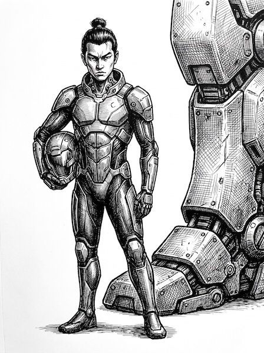  
  *A prodigy of the Obsidian Order. Kaito relies on raw reflexes and blinding speed over heavy armor. He views combat as a sacred duel, demanding to look his opponents in the eyes before he strikes.*  
  - **Initiative Bonus**: +3  
  - **Sworn Vow**: Vow of Respect (Rei)  
  - **Point Cost**: 45 pts  

- **Kenji Takahashi ("Shogun")**  
  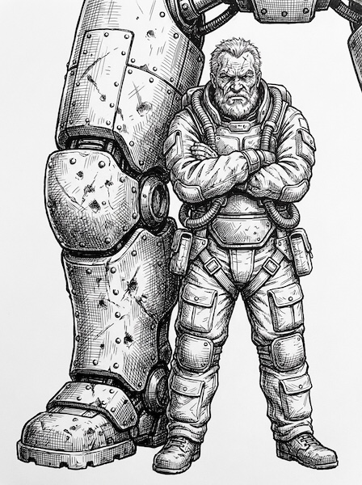  
  *A fiercely traditional veteran of the Inner Systems Defense Force. Takahashi operates almost exclusively in heavily armored assault frames and believes that momentum dictates victory. He is famous for his unyielding, straight-line charges into enemy formations.*  
  - **Initiative Bonus**: +2  
  - **Sworn Vow**: Vow of Courage (Yuu)  
  - **Point Cost**: 30 pts  

- **Lyra Vance ("Viper")**  
  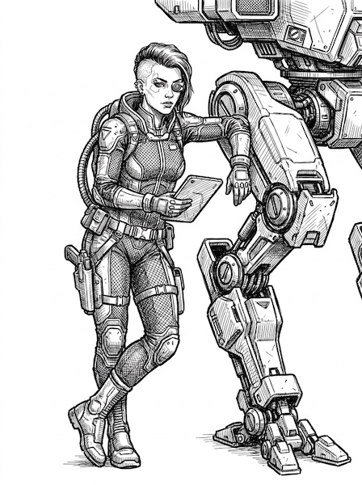  
  *A ghost on the battlefield, Lyra operates deep behind enemy lines for the Sovereign Coalition. She pilots electronic warfare frames equipped with active camouflage. Rather than engaging in chaotic brawls, she relies on surgical precision, dismantling a target's mobility and weapon systems limb-by-limb before delivering the killing blow.*  
  - **Initiative Bonus**: +3  
  - **Sworn Vow**: Vow of Mercy (Jin)  
  - **Point Cost**: 45 pts

#### 7.3.2 Initiative & Pilot Check Bonus
Equipping a Named Pilot on an Iron Frame grants a flat Initiative bonus of **+1, +2, or +3** (declared at build time, up to a maximum final Initiative of 12). This represents their tactical foresight and combat reflexes.
- **Pilot Checks**: In addition to modifying the Frame's Initiative, the Named Pilot adds their Initiative bonus (+1, +2, or +3) as a flat modifier to all **Pilot Checks** (to avoid falling Prone). If the pilot is dishonored, they immediately lose this bonus as well.
- **Point Cost (Optional)**: If playing with the optional point rules (see Section 7.1), Named Pilots cost points based on their Initiative bonus:
  - **+1 Initiative & Pilot Checks**: 15 pts
  - **+2 Initiative & Pilot Checks**: 30 pts
  - **+3 Initiative & Pilot Checks**: 45 pts

#### 7.3.3 Iron Protocol Vows
Every Named Pilot is sworn to a specific vow under the Iron Protocol, reflecting their martial pride. If a pilot violates their vow during a battle, they are **dishonored**: they immediately lose their Initiative bonus for the rest of the battle, and suffer additional penalties.

Choose one Vow for your Named Pilot:

##### Vow of Courage (Yuu)
*“The warrior does not retreat; we are the anvil upon which the enemy breaks.”*
- **The Constraint**: The pilot cannot use the **Reverse (R)** movement command.
- **Dishonor Penalty**: If the Frame ever reverses, it is dishonored. In addition to losing the Initiative bonus, its Reactor Rating is reduced by 2 EP per turn for the rest of the battle.

##### Vow of Respect (Rei)
*“A warrior meets their foe face-to-face. Anonymous death from behind is the weapon of cowards.”*
- **The Constraint**: The pilot cannot target an enemy Frame from its **Rear Hit Zone**, nor fire indirect-guided missiles without direct Line of Sight (even if a Tactical Datalink is active).
- **Dishonor Penalty**: If the pilot executes an attack from the Rear Hit Zone or fires an indirect weapon without direct LOS, they are dishonored, and their Evasion Limit is permanently reduced by 2 EVA points for the rest of the battle.

##### Vow of Honor (Meiyo)
*“Seek only the strongest. There is no glory in crushing the weak.”*
- **The Constraint**: If a higher-initiative or higher-tonnage enemy Frame is detected and within the pilot's Torso Firing Arc, the pilot **must** target a higher-priority Frame instead of any lower-tier targets. (If both a higher-tonnage and higher-initiative target are present, the pilot may choose between them, but cannot fire at a target that is inferior in *both* categories).
- **Dishonor Penalty**: If the pilot fires at a weaker target when a more prestigious target was valid, they are dishonored, and their weapons' EP costs increase by +1 EP per shot for the rest of the battle.

##### Vow of Mercy (Jin)
*“Victory is in the disarm, not the slaughter. A dead enemy learns nothing.”*
- **The Constraint**: The pilot cannot target the Torso or Head of an enemy Frame if its Arms or Legs still have remaining Internal Structure. They must attempt to dismantle or disable the limbs first.
- **Dishonor Penalty**: If the pilot intentionally targets the Torso or Head while a limb remains functional, they are dishonored. Plagued by a crisis of conscience, their Frame suffers a permanent -2 modifier to all future To-Hit rolls.

##### Vow of Honesty (Makoto)
*“Deception is a crutch. I will stand in the light and let them witness their end.”*
- **The Constraint**: The pilot cannot activate Active Metamaterial Coating (AMC), Smoke Launchers, or ECM, nor can they benefit from the umbrella of allied ECM or Smoke.
- **Dishonor Penalty**: If the pilot activates or relies on any active stealth/EW system to hide, they are dishonored. Their Capacitor Max is immediately and permanently reduced to 0 (they refuse to store energy out of shame).

##### Vow of Loyalty (Chuugi)
*“My shield is the wall that protects my kin. I will fall before they do.”*
- **The Constraint**: If a friendly Frame within 3 hexes has lower current Armor DR or Internal Structure than the pilot, the pilot cannot move further away from that ally.
- **Dishonor Penalty**: If the pilot abandons a damaged ally by intentionally moving outside the 3-hex radius, they are dishonored, and immediately suffer an automatic Reactor penalty of -3 EP per turn permanently.

---

## 8. Iron Frame Roster
> *"Battles are won by slaughter and maneuver. The greater the general, the more he contributes in maneuver, the less he demands in slaughter." — Winston Churchill*

Here are five pre-configured Iron Frames ready for combat.

### 8.1 IF-25L-1 "Jackal" (Light Recon Frame)
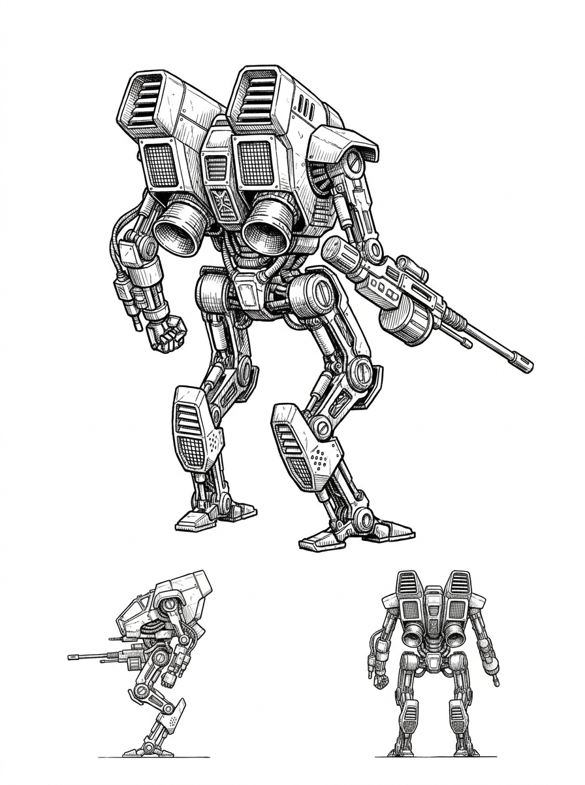

*A fragile but blisteringly fast scout frame. It relies on its extreme evasion and jump jets to outmaneuver heavier foes, darting in to deliver surgical strikes before leaping to safety.*
- **Initiative**: 12
- **Chassis Mass (Tonnage)**: 25 Tons (Light, Mass Value 1)
- **Point Value**: 370 points
- **Reactor Rating**: 8 EP/turn
- **Capacitor Max**: 3 EP
- **Evasion Limit**: 6 EVA
- **Movement Limit**: 7 hexes
- **Armor DR by Location**: Head: 2 | Torso: 2 | Left Arm: 1 | Right Arm: 1 | Legs: 2
- **Internal Structure**: Head: 4 | Torso: 8 | Left Arm: 4 | Right Arm: 4 | Legs: 5
- **Equipped Systems**:
  - Standard Sensor Suite (Visual [VIS]/Infrared [IR]/Microwave [Radar])
  - Jump Jets [Light HP]
  - Tactical Datalink [Light HP]
- **Equipped Weapons**:
  - **Left Arm** [Light HP]: Laser (1d6 Combat + 1d6 End damage)
  - **Right Arm** [Light HP]: Autocannon (10 Bursts, loaded with 10 AP)

### 8.2 IF-45M-1 "Specter" (Medium Stealth Frame)
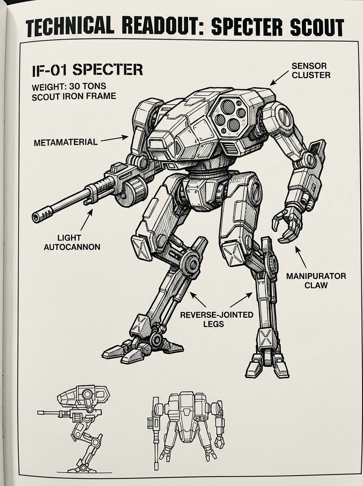

*A fast, stealthy frame designed to infiltrate enemy lines, disrupt sensors, and escape using high evasion and metamaterial cloaking.*
- **Initiative**: 10
- **Chassis Mass (Tonnage)**: 45 Tons (Medium, Mass Value 2)
- **Point Value**: 435 points
- **Reactor Rating**: 9 EP/turn
- **Capacitor Max**: 4 EP
- **Evasion Limit**: 5 EVA
- **Movement Limit**: 5 hexes
- **Armor DR by Location**: Head: 3 | Torso: 4 | Left Arm: 2 | Right Arm: 2 | Legs: 3
- **Internal Structure**: Head: 5 | Torso: 10 | Left Arm: 6 | Right Arm: 6 | Legs: 8
- **Equipped Systems**:
  - Standard Sensor Suite (Visual [VIS]/Infrared [IR]/Microwave [Radar])
  - Active Metamaterial Coating (AMC)
  - Tactical Datalink
- **Equipped Weapons**:
  - **Left Arm** [Light HP]: Laser (1d6 Combat + 1d6 End damage)
  - **Right Arm** [Medium HP]: Disruptor Cannon

### 8.3 IF-55M-1 "Vanguard" (Medium Skirmisher Frame)
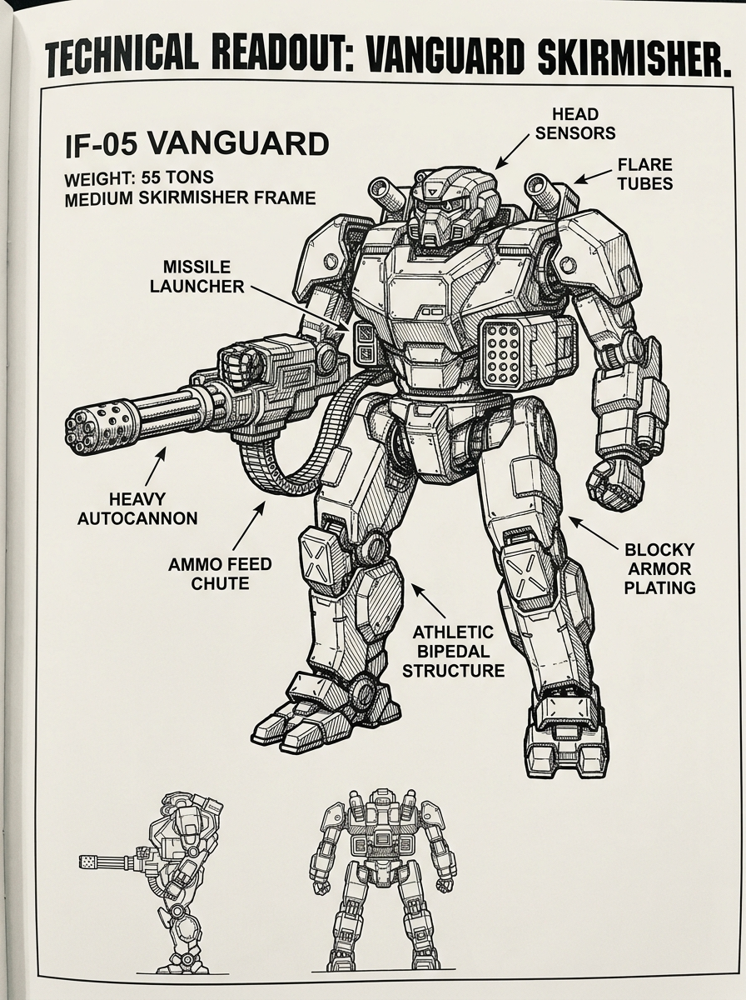

*The workhorse of the fleet. Balanced defense, solid firepower, and equipped with flares to deflect seeking missiles.*
- **Initiative**: 6
- **Chassis Mass (Tonnage)**: 55 Tons (Medium, Mass Value 2)
- **Point Value**: 430 points
- **Reactor Rating**: 12 EP/turn
- **Capacitor Max**: 6 EP
- **Evasion Limit**: 4 EVA
- **Movement Limit**: 5 hexes
- **Armor DR by Location**: Head: 4 | Torso: 5 | Left Arm: 3 | Right Arm: 3 | Legs: 4
- **Internal Structure**: Head: 6 | Torso: 12 | Left Arm: 8 | Right Arm: 8 | Legs: 10
- **Equipped Systems**:
  - Standard Sensor Suite (Visual [VIS]/Infrared [IR]/Microwave [Radar])
  - ECM Suite [Medium HP]
  - Flare Launcher (3 charges) [Light HP]
  - Tactical Datalink [Light HP]
- **Equipped Weapons**:
  - **Left Arm** [Light HP]: Autocannon (10 Bursts, loaded with 5 AP / 5 HEI)
  - **Right Arm** [Light HP]: Laser (1d6 Combat + 1d6 End damage)

### 8.4 IF-75H-1 "Paladin" (Heavy Fire-Support Frame)
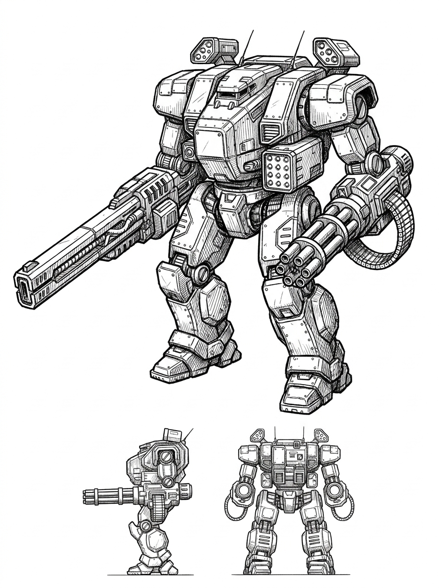

*A heavy bombardment frame equipped to deliver high-impact kinetic support and rain cluster munitions, protected by layered defensive launchers.*
- **Initiative**: 5
- **Chassis Mass (Tonnage)**: 75 Tons (Heavy, Mass Value 3)
- **Point Value**: 540 points
- **Reactor Rating**: 14 EP/turn
- **Capacitor Max**: 8 EP
- **Evasion Limit**: 2 EVA
- **Movement Limit**: 4 hexes
- **Armor DR by Location**: Head: 4 | Torso: 6 | Left Arm: 4 | Right Arm: 4 | Legs: 5
- **Internal Structure**: Head: 7 | Torso: 16 | Left Arm: 10 | Right Arm: 10 | Legs: 12
- **Equipped Systems**:
  - Standard Sensor Suite (Visual [VIS]/Infrared [IR]/Microwave [Radar])
  - Flare Launcher (3 charges) [Light HP]
  - Smoke Launcher (2 charges) [Light HP]
  - Tactical Datalink [Light HP]
- **Equipped Weapons**:
  - **Right Arm** [Heavy HP]: Rail Gun (5 rounds)
  - **Left Arm** [Light HP]: Autocannon (10 AP Bursts)
  - **Torso** [Medium HP]: Guided Missile Launcher (4 Salvos, Microwave [Radar] Guided, Cluster Warheads)

### 8.5 IF-90A-1 "Colossus" (Heavy Assault Frame)
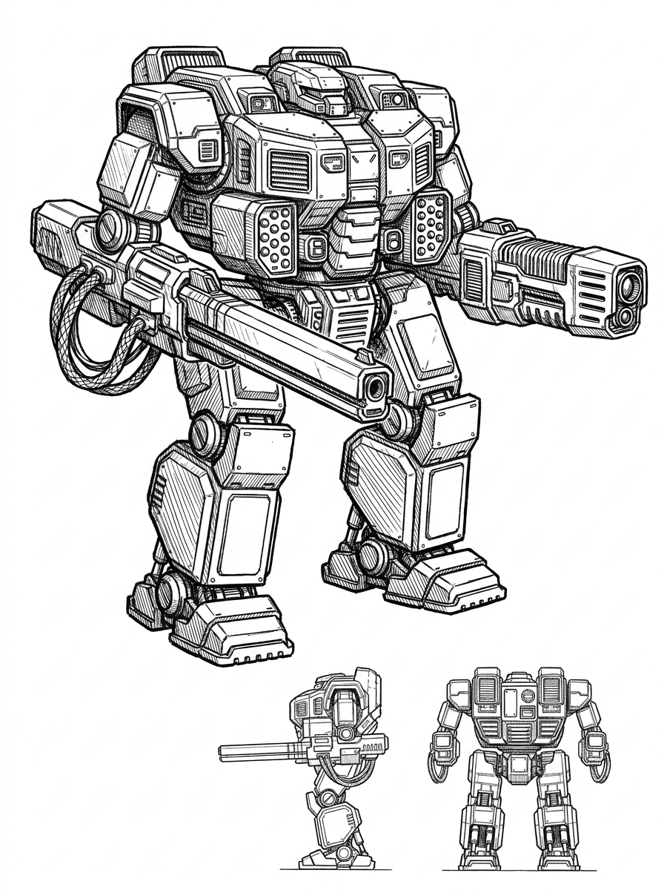

*A walking fortress. Generates massive amounts of energy to feed its Rail Gun and Thermal Lance, relying on heavy armor and smoke screens for protection.*
- **Initiative**: 3
- **Chassis Mass (Tonnage)**: 90 Tons (Assault, Mass Value 4)
- **Point Value**: 655 points
- **Reactor Rating**: 18 EP/turn
- **Capacitor Max**: 10 EP
- **Evasion Limit**: 1 EVA
- **Movement Limit**: 3 hexes
- **Armor DR by Location**: Head: 4 | Torso: 7 | Left Arm: 5 | Right Arm: 5 | Legs: 6
- **Internal Structure**: Head: 8 | Torso: 20 | Left Arm: 12 | Right Arm: 12 | Legs: 15
- **Equipped Systems**:
  - Standard Sensor Suite (Visual [VIS]/Infrared [IR]/Microwave [Radar])
  - Smoke Launcher (2 charges) [Light HP]
  - Flare Launcher (3 charges) [Light HP]
  - Tactical Datalink [Light HP]
- **Equipped Weapons**:
  - **Left Arm** [Heavy HP]: Thermal Lance
  - **Right Arm** [Heavy HP]: Rail Gun (5 rounds)
  - **Torso** [Medium HP]: Guided Missile Launcher (4 Salvos, IR Guided, EMP Warheads)

---
*Game Design by Antigravity & the User.*
