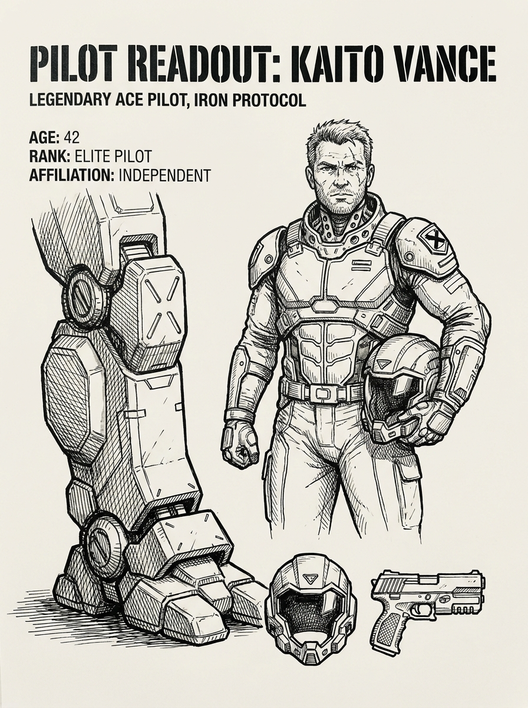
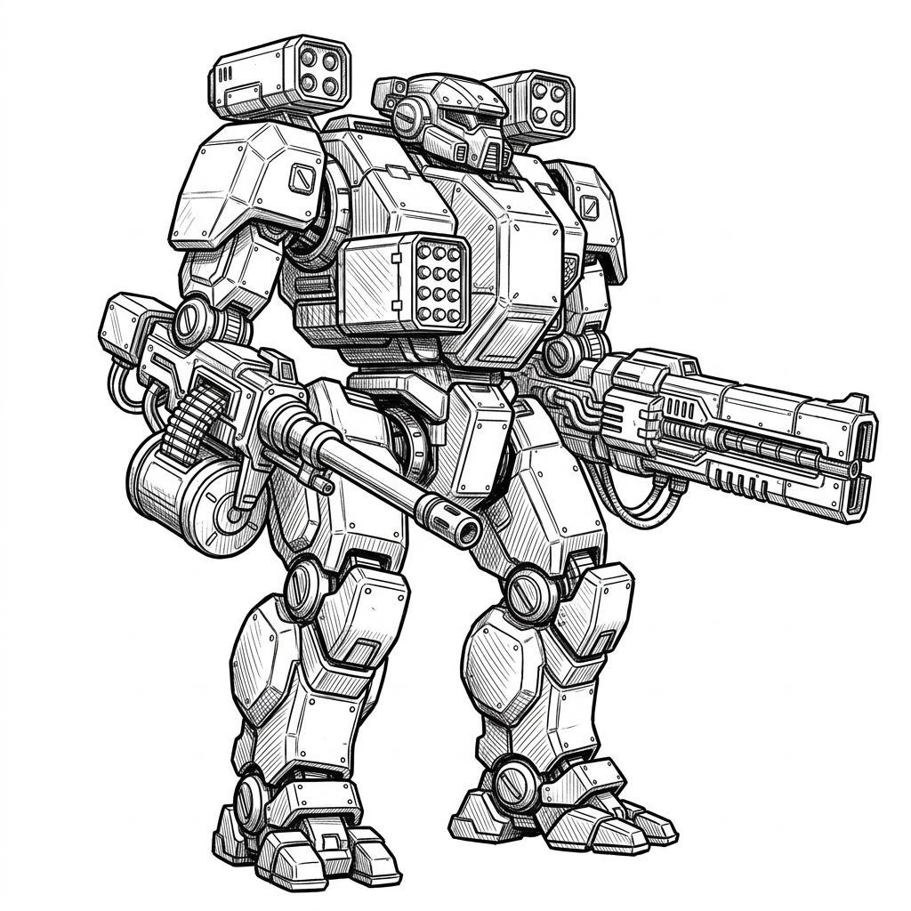
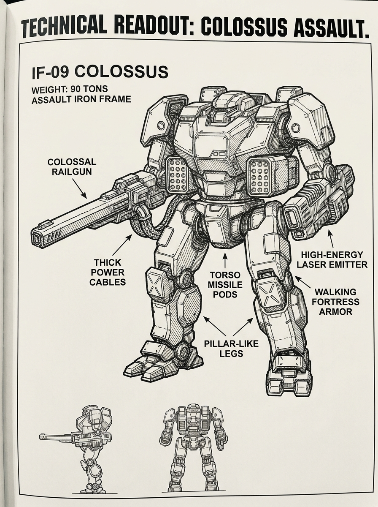

# Iron Protocol
**A Tactical Game of Iron Frame Combat**

*Fusing the tactical resource management and locational damage of BattleTech with the turn-order dynamics and initiative-based action of X-Wing Miniatures.*

---

## Table of Contents
- [Introduction: The Iron Protocol](#introduction-the-iron-protocol)
  - [Why We Fight in Frames](#the-lore-of-the-protocol-why-we-fight-in-frames)
  - [Core Tenets of the Protocol](#core-tenets-of-the-protocol)
- [1. Core Mechanics & Setup](#1-core-mechanics--setup)
  - [1.1 The Hex Grid](#11-the-hex-grid)
  - [1.2 The Iron Frame Profile](#12-the-iron-frame-profile)
- [2. Turn Sequence](#2-turn-sequence)
  - [2.1 Energy Phase](#21-energy-phase)
  - [2.2 Activation Phase](#22-activation-phase-reverse-initiative-order)
    - [2.2.1 Movement Examples](#221-movement-examples)
  - [2.3 Combat Phase](#23-combat-phase-initiative-order)
    - [2.3.1 Combat Examples](#231-combat-examples)
  - [2.4 End Phase](#24-end-phase)
- [3. Terrain & Elevation](#3-terrain--elevation)
  - [3.1 Summary of Terrain Types](#31-summary-of-terrain-types)
  - [3.2 Terrain Explanations & Mechanics](#32-terrain-explanations--mechanics)
  - [3.3 Elevation Levels](#33-elevation-levels)
- [4. Sensors, Stealth, and Detection](#4-sensors-stealth-and-detection)
  - [4.1 The Sensor Suite](#41-the-sensor-suite-head-location)
  - [4.2 Stealth & Defensive Countermeasures](#42-stealth--defensive-countermeasures)
  - [4.3 Tactical Datalink](#43-tactical-datalink-head-location)
- [5. Weapons & Munitions](#5-weapons--munitions)
  - [5.1 Autocannon Munitions](#51-autocannon-munitions)
  - [5.2 Guided Missile Systems](#52-guided-missile-systems)
- [6. Damage & Critical Hits](#6-damage--critical-hits)
  - [6.1 Hit Location Table](#61-hit-location-table-2d6)
  - [6.2 Critical Hit Tables](#62-critical-hit-tables-1d6)
  - [6.3 Falling and the Prone State](#63-falling-and-the-prone-state)
- [7. Optional Rules](#7-optional-rules)
  - [7.1 Squad Building & Point Values](#71-squad-building--point-values)
  - [7.2 Visibility & Sensors](#72-visibility--sensors)
  - [7.3 Gravity & Locomotion](#73-gravity-locomotion)
  - [7.4 Atmospheric Composition](#74-atmospheric-composition)
- [8. Named Pilots & The Code of Honor](#8-named-pilots--the-code-of-honor)
  - [8.1 Initiative Bonus](#81-initiative-bonus)
  - [8.2 Iron Protocol Vows](#82-iron-protocol-vows)
- [9. Sample Frames](#9-sample-frames)
  - [9.1 IF-01 "Specter"](#91-if-01-specter-light-scout-frame)
  - [9.2 IF-05 "Vanguard"](#92-if-05-vanguard-medium-skirmisher-frame)
  - [9.3 IF-07 "Crusader"](#93-if-07-crusader-heavy-fire-support-frame)
  - [9.4 IF-09 "Colossus"](#94-if-09-colossus-heavy-assault-frame)

---

## Introduction: The Iron Protocol
In the war-torn stars of the far future, planetary warfare is not decided by faceless drone swarms, heavy tank divisions, or indiscriminate orbital bombardment. Instead, conflicts are resolved by the pilots of massive, heavily armed walking weapon platforms known as **Iron Frames**. 

These elite pilots adhere to the **Iron Protocol**—an ancient, unyielding code of martial honor and combat conduct inspired by Earth's historical Bushido. The Protocol dictates that conflicts must be settled on planetary surfaces in designated engagement zones, frame-to-frame, where tactical energy management, maneuverability, and pilot skill determine the victor. To violate the Protocol is to invite immediate dishonor, galactic exile, and execution by all coalitions.

### The Lore of the Protocol: Why We Fight in Frames

The emergence of the Iron Protocol was born of necessity, forged from the ashes of the **Cinder Wars**—a period of total industrial warfare that left dozens of settled planets as lifeless, radioactive dust. To prevent extinction, the warring factions signed the Accords, establishing the Protocol to govern all future conflicts.

#### 1. The Preservation of Biospheres
Habitable worlds are warfare's ultimate prize, but they are exceedingly rare and precious. Conventional mass warfare—carpet bombing, tactical nuclear strikes, and massive tank divisions tearing up agricultural land—irreversibly ruins planetary biospheres. The Iron Protocol strictly outlaws weapons of mass destruction, orbital bombardment, and heavy tracked planetary armor. Battles are confined to designated, unpopulated "Honor Fields" to preserve planetary infrastructure and ecologies for the victor.

#### 2. The Iron Aegis (Planetary Shielding)
Every settled world is protected by the **Iron Aegis**—a grid of planetary defense shields, surface-to-orbit lasers, and hyper-velocity missile silos. Any starship attempting to conduct orbital bombardment is instantly targeted and destroyed. Surface invasions must be launched via stealth drop-pods containing highly localized ground forces, bypassing the defensive network. 

#### 3. Bipedal Superiority Over Tanks & Aircraft
Frontier worlds are jagged, unpaved, and volatile. Tectonic shifts, dense alien forests, and ruins of ancient mega-structures make standard tracked vehicles (tanks) useless; they are easily bottlenecked in canyons or trapped by rough terrain. Fighter aircraft are blinded by the heavy atmospheric dust, electromagnetic storms, and thermal anomalies common on these worlds. **Iron Frames**, with their articulated bipedal limbs and vector thrusters, possess unmatched all-terrain mobility, allowing them to climb crags, leap chasms, and pivot dynamically in close-quarters combat.

#### 4. The Ban on Autonomous Warfare (The Human Core)
Following a catastrophic AI rebellion, treaties strictly outlaw autonomous combat drones and artificial combat intelligences. War must be fought by humans, exposing themselves to direct risk. The Iron Frame serves as an extension of the pilot's own body, synchronizing via neural datalink. War is no longer a matter of industrial factory output, but a test of personal discipline, honor, and martial skill.

### Core Tenets of the Protocol
- **Honor in the Arc**: Foe must face foe. Torso twisting represents the deliberate, disciplined adjustments of a pilot's stance to align weapons with the enemy.
- **Mastery of Energy**: An Iron Frame's reactor is the pilot's lifeblood. Distributing energy between thruster moves, active countermeasures, and weapons systems is the ultimate test of martial discipline.
- **Precision Striking**: The Protocol forbids mindless destruction. Pilots target specific components—locating and disabling weapons, shields, and sensors systematically to neutralize the opponent with precision.

---

## 1. Core Mechanics & Setup

### 1.1 The Hex Grid & Time Scale
The game is played on a standard hexagonal grid.
- **Distance Scale**: Each hex represents approximately **30 meters** of terrain.
- **Time Scale**: A single combat turn (round) represents approximately **10 seconds** of real-time combat.
- **Facing**: A Frame has two components of facing:
  - **Leg Facing (Movement)**: The direction the legs face, which determines the direction of forward, backward, and diagonal movement.
  - **Torso Facing (Combat)**: The direction the upper body faces. By default, the torso aligns with the leg facing, but a Frame can twist its torso (see Torso Twisting).
- **Torso Twisting**: A Frame's upper body can twist 1 hex side (60 degrees) to the left or right of its current leg facing.
- **Firing Arcs**: Firing arcs are determined relative to the **Torso Facing**, and weapons are restricted to specific arcs based on their mounting location:
  - **Front Arc (Torso Weapons Only)**: The 60-degree wedge directly in front of the Torso (covering 1 hexside). Only weapons mounted in the **Torso** may fire into this arc.
  - **Left Side Arc (Left Arm Weapons Only)**: The 120-degree wedge covering the front-left and rear-left directions of the Torso (covering 2 hexsides). Only weapons mounted in the **Left Arm** may fire into this arc.
  - **Right Side Arc (Right Arm Weapons Only)**: The 120-degree wedge covering the front-right and rear-right directions of the Torso (covering 2 hexsides). Only weapons mounted in the **Right Arm** may fire into this arc.
  - **Rear Arc**: The 60-degree wedge directly behind the Torso (covering 1 hexside). No weapons can be fired into the Rear Arc.
- **Line of Sight (LOS)**: Draw a straight line from the center of the attacking Frame's hex to the center of the target's hex. If the line passes through blocking terrain (such as hills or buildings), a Smoke template, or another Frame's hex, **Visual Line of Sight (Visual LOS)** is blocked.
  - **Interaction with Smoke**: Smoke templates block **Visual LOS** and **Visual locks** (precluding the use of Visual-guided or Visual-spectrum weapons through or into the smoke hex). However, Smoke does *not* block Infrared (IR) or Microwave (Radar) line of sight; weapons using these bands can still target and fire through smoke.
  - **Intervening Frames**: Both friendly and enemy Frames block direct Visual LOS if their hex lies along the LOS line, *provided* the intervening Frame's Weight Class is **equal to or larger** than the target Frame's Weight Class (Light, Medium, Heavy, Assault). A smaller Frame cannot block LOS to a larger target (e.g., a Light Frame cannot hide a Heavy Frame, but a Heavy Frame can hide a Light or Medium Frame).
  - **Interaction with Active Metamaterial Coating (AMC)**:
    - A Frame using active **Visual-Camouflage Mode** is visually invisible. Attacking frames do not have Visual LOS to it, and it cannot be targeted using the Visual (VIS) spectrum.
    - Additionally, because light passes through a visually camouflaged Frame, it **does not block Visual LOS** to any Frames positioned behind it.
    - AMC modes tuned to Microwave (Radar) or Infrared (IR) suppression do not affect visual visibility, and therefore block Visual LOS normally.

### 1.2 The Iron Frame Profile
Each Iron Frame (IF) is defined by its chassis, reactor, capacitor, and mounted components:
- **Initiative (2-12)**: A static value representing pilot reaction speed and chassis agility. Higher initiative frames shoot first but move last, while lower initiative frames move first but shoot last.
- **Chassis Mass (Tonnage)**: Built on a scale from **20 to 100 Tons** (typically in increments of 5). Tonnage determines the Frame's weight class and its corresponding **Mass Value** used for collision damage:
  - **Light** (20–35 Tons): Mass Value = 1
  - **Medium** (40–55 Tons): Mass Value = 2
  - **Heavy** (60–75 Tons): Mass Value = 3
  - **Assault** (80–100 Tons): Mass Value = 4
- **Reactor Rating**: The number of Energy Points (EP) generated by the Frame at the start of each turn.
- **Capacitor Max**: The maximum amount of unused EP that can be stored in the Capacitor between turns.
- **Evasion Limit**: The maximum Evasion Points (EVA) a Frame can accumulate through movement in a single turn.
- **Movement Limit**: The maximum number of hexes a Frame can enter (via walking, reversing, strafing, or jumping) in a single turn. This represents physical actuator limits at a 10-second scale:
  - **Light**: 6 hexes (approx. 65 km/h)
  - **Medium**: 5 hexes (approx. 54 km/h)
  - **Heavy**: 4 hexes (approx. 43 km/h)
  - **Assault**: 3 hexes (approx. 32 km/h)
  *(Pivoting/turning does not count toward the Movement Limit).*
- **Armor Damage Reduction (DR)**: Each of the 5 hit locations (**Head**, **Torso**, **Left Arm**, **Right Arm**, and **Legs**) has its own Armor DR rating. When a location is hit, its current Armor DR reduces incoming damage. If damage exceeds this DR (penetrates the armor), the remaining damage is applied to that location's Internal Structure, and the location's Armor DR is permanently reduced by 1.
- **Structural Integrity**: The maximum Internal Structure (IS) points for each of the 5 locations.
- **Mounted Weapons**: Weapons can only be mounted in the **Left Arm**, **Right Arm**, or **Torso**. The mounting location determines the weapon's Firing Arc (Left Arm = Left Side Arc, Right Arm = Right Side Arc, Torso = Front Arc).

---

## 2. Turn Sequence
Each round of play is divided into four distinct phases:
1. **Energy Phase**: Generate energy and allocate stealth/system upkeep.
2. **Activation Phase**: Move Frames and spend EP on movement in **reverse initiative order** (lowest initiative first).
3. **Combat Phase**: Declare and resolve attacks in **initiative order** (highest initiative first).
4. **End Phase**: Store unused energy, dissipate temporary effects, and clean up the board.

### 2.1 Energy Phase
At the start of the turn, players perform the following steps:
1. **Energy Generation**: Every Frame generates EP equal to its Reactor Rating. This is added to any EP currently stored in the Capacitor.
2. **Stealth & System Upkeep**: Players allocate EP to maintain active stealth or ECM systems (e.g., Active Metamaterial Coating, ECM). This EP is immediately deducted from the available pool. Any remaining EP is carried over to be spent dynamically on movement and combat.

### 2.2 Activation Phase (Reverse Initiative Order)
Frames activate one at a time, beginning with the **lowest Initiative** value and counting up.
- **Dynamic Movement Execution**: When a Frame activates, the player decides how to move it on the fly, spending EP from their current energy pool step-by-step. This allows players to react directly to the movements of previously activated (lower-initiative) frames.
- **Movement Limit**: A Frame cannot enter more hexes during its activation than its weight class **Movement Limit** (Light = 6, Medium = 5, Heavy = 4, Assault = 3). Changing Leg Facing (pivoting) does not count as entering a hex and is not restricted by this limit.
  - **Forward Walk (W)**: Move 1 hex forward. Cost: 1 EP.
  - **Reverse (R)**: Move 1 hex backward without changing facing. Cost: 2 EP.
  - **Pivot/Turn (TL/TR)**: Change facing by 60 degrees (one hexside) left or right. Cost: 1 EP.
  - **Strafe (SL/SR)**: Move 1 hex to the left-front or right-front diagonal hex while maintaining original facing. Cost: 2 EP.
  - **Jump Jet (J)**: Only available to **Light** and **Medium** weight classes (20–55 Tons). Heavy and Assault Frames cannot be equipped with Jump Jets and cannot jump.
    - *Cost*: 2 EP per hex.
    - *Movement*: The Frame jumps in a straight line to a hex within its maximum jump distance (default maximum of 4 hexes). It bypasses all intervening terrain, obstacles, and other Frames.
    - *Landing & Death from Above (DFA)*:
      - **Standard Landing**: Normally, a Frame lands in an unoccupied hex. Upon landing, the pilot sets the Leg Facing to any direction for free.
      - **Death from Above (DFA) Strike**: Alternatively, a pilot may target an occupied hex to perform a DFA strike.
      - **DFA Damage**: Both Frames suffer damage rolled using a pool of $d6$ dice:
        $$\text{DFA Damage Dice} = \text{Jumping Frame's Mass Value} \times \text{Hexes Jumped}$$
      - **Locations Hit**: 
        - The target Frame suffers the damage to its **Torso** (on a 1d6 roll of 2–6) or its **Head** (on a 1d6 roll of 1).
        - The jumping Frame suffers the damage directly to its **Legs** (representing landing impact).
        - Both damage hits are reduced by the respective location's Armor DR normally. Evasion (EVA) does not reduce DFA damage.
      - **Displacement**: After damage is resolved, the target's player (the defender) slides the jumping Frame into any unoccupied adjacent hex of their choice. If no adjacent hex is unoccupied, the jumping Frame falls Prone, taking an additional 2d6 damage to its Legs, and is placed in the nearest unoccupied hex (see Section 6.3).
    - *Evasion*: Due to the high velocity and ballistic trajectory of flight, jumping generates **2 EVA per hex jumped** (up to the Frame's Evasion Limit).
- **Collisions & Blocking**: If a Frame's movement path would enter a hex occupied by another Frame, a collision occurs. The moving Frame immediately stops in the last unoccupied hex, its activation ends, and both frames suffer damage.
  - **Collision Damage**: Both the moving Frame and the stationary target Frame suffer damage to a random location determined by rolling on the Hit Location Table individually. Evasion (EVA) points do **not** reduce collision damage, as the impact is physical and unavoidable.
  - **Damage Calculation**: The damage is rolled using a pool of $d6$ dice based on the moving Frame's **Mass Value** (Light = 1, Medium = 2, Heavy = 3, Assault = 4) and its speed (the number of hexes moved in the current activation before impact):
    $$\text{Collision Damage Dice Pool} = \text{Mass Value} \times \text{Speed Factor}$$
    Where **Speed Factor** is the number of hexes moved in this activation prior to impact divided by 2 (rounded up, minimum of 1).
    *(Example: An Assault Frame [90 Tons, Mass Value 4] that moves 3 hexes before colliding with a target rolls $4 \times 2 = 8d6$ damage. Both frames suffer this damage to a random location, reduced by their respective Armor DR. EVA is not subtracted).*
  - **Stability Roll**: After resolving collision damage, both Frames must check if they fall Prone (see Section 6.3).
- **Accumulating Evasion**: For every hex a Frame successfully exits during its activation, it gains 1 **Evasion Point (EVA)**, up to its Evasion Limit. These EVA points are tracked using tokens and represent the difficulty of targeting a moving frame.
- **Torso Twist**: At the very end of its activation (after all movement is completed), the Frame may perform a free Torso Twist. The player can rotate the upper body of the Frame 1 hex side (60 degrees) to the left or right of its current Leg Facing, or reset it to align with the Leg Facing. This sets the Frame's Torso Facing (and Firing Arcs) for the upcoming Combat Phase. The torso remains in this position until the Frame activates in the next turn's Activation Phase.

#### 2.2.1 Movement Examples
- **Example 1 (Tactical Maneuvering)**: An IF-05 "Vanguard" (Reactor 12) starts its activation on Level 0 with a full energy pool of 12 EP. 
  1. It performs a **Forward Walk** (1 EP) into an adjacent Level 1 Pavement hex. (Cost: 1 EP + 1 EP climbing cost = 2 EP total).
  2. It performs a **Pivot/Turn** (1 EP) to rotate its Leg Facing 60 degrees left.
  3. It executes a **Strafe Right** (2 EP) to slide diagonally into a Light Woods hex on Level 1. (Cost: 2 EP + 1 EP woods entry cost = 3 EP total).
  4. It performs another **Forward Walk** (1 EP) through the woods on Level 1. (Cost: 1 EP + 1 EP woods entry cost = 2 EP total).
  - *EP Expenditure*: $2 + 1 + 3 + 2 = 8$ EP. The Vanguard has 4 EP remaining in its pool to spend on active systems or firing weapons during the Combat Phase.
  - *Evasion accumulated*: It exited 3 hexes during its movement, earning **3 EVA tokens** (capped at its Evasion Limit of 3 EVA).
  - *Final Step*: The pilot performs a free **Torso Twist** 60 degrees right to point its torso-mounted guided missiles toward the target's expected location.

- **Example 2 (Jump Jet Cliff-Jumping)**: An IF-01 "Specter" (Reactor 9, Capacitor 3, total 12 EP available) starts its activation at the base of a steep Level 2 cliff (Level 0 hex adjacent to a Level 2 hex).
  1. It declares a **Jump Jet** maneuver targeting an unoccupied Level 2 hex 3 spaces away, directly on top of the cliff (bypassing the steep height difference which blocks standard walking).
  - *EP Expenditure*: 3 hexes jumped $\times$ 2 EP = 6 EP. 
  - *Evasion accumulated*: Jumping generates 2 EVA per hex. 3 hexes $\times$ 2 = 6 EVA, which is capped at the Specter's Evasion Limit of **5 EVA**.
  - *Landing*: Upon landing, the pilot sets the Specter's Leg Facing facing the enemy's rear quadrant for free.
  - *Final Step*: The pilot leaves the torso aligned forward to keep its arm-mounted Disruptor Cannon pointed at the target. The Specter has 6 EP remaining to fire its weapons in the Combat Phase.

### 2.3 Combat Phase (Initiative Order)
Frames attack in order of **highest Initiative** to **lowest Initiative**.
- **Instant Resolution**: Unlike some tabletop games, damage is resolved *instantly*. If a high-initiative Frame destroys or disables a weapon on a lower-initiative Frame, that lower-initiative Frame cannot use that weapon when its turn to fire comes.
- **Attack Sequence**:
  1. **Select Weapon & Pay EP Cost**: Deduct the weapon's EP cost from the Frame's current pool.
  2. **Verify Line of Sight (LOS) and Arc**: The target must be within the weapon's firing arc (determined by the Torso Facing set at the end of the Activation Phase) and have clear LOS (unless using a weapon that permits indirect fire).
  3. **Verify Sensor Detection & Lock**: The target must be detected on a spectrum compatible with the weapon (Visual [VIS], Infrared [IR], or Microwave [Radar]). If the target is undetected on that spectrum, the attack cannot be declared.
  4. **Determine Hit Location**: Roll 2d6 on the **Hit Location Table**.
  5. **Roll Damage**: Roll the weapon's damage dice.
  6. **Apply Target Evasion**: Subtract the target's current EVA points from the rolled damage.
  7. **Apply Armor DR**: Subtract the target location's current Armor DR from the remaining damage.
  8. **Resolve Damage & Armor Degradation**: 
     - If the remaining damage is **greater than 0**, the excess damage is deducted directly from that location's **Internal Structure**. Additionally, because the armor was penetrated, the Armor DR of that location is permanently **reduced by 1** (to a minimum of 0).
     - If the remaining damage is **0 or less**, the armor successfully blocks the hit; the location suffers no damage, and its Armor DR does not degrade.
  9. **Roll Critical Hits**: If the location's Internal Structure takes 1 or more points of damage, roll 1d6 on the **Critical Hit Table** for that location.

#### 2.3.1 Combat Examples
- **Example 1 (Direct Laser Fire & Critical Hit)**: During the Combat Phase, the IF-09 "Colossus" (Initiative 3) resolves its attack against the IF-05 "Vanguard" (Initiative 6).
  1. **Weapon Selection**: The Colossus pilot spends 4 EP to fire the **High Energy Laser (HEL)** mounted on its Left Arm.
  2. **Verify Arc and LOS**: The Vanguard is located within the Colossus's Left Side Arc (Left Arm mount). Line of Sight is clear of blocking terrain.
  3. **Verify Lock**: The Colossus has a Visual (VIS) lock on the Vanguard.
  4. **Hit Location**: The Colossus rolls 2d6 on the Hit Location Table: rolls a 7, indicating a **Torso (Center)** hit.
  5. **Roll Damage**: The Colossus rolls 2d6 for the HEL: rolls a total of 10 damage.
  6. **Apply Target Evasion**: The Vanguard has 3 EVA tokens. Subtract 3 from damage: $10 - 3 = 7$ damage remaining.
  7. **Apply Armor DR**: The Vanguard's Torso currently has an Armor DR of 5. Subtract 5 from damage: $7 - 5 = 2$ damage remaining.
  8. **Resolve Damage & Degradation**: 
     - The remaining 2 damage penetrates the armor and is deducted directly from the Vanguard's Torso Internal Structure (reducing it from 12 to 10).
     - Because the armor was penetrated, the Vanguard's Torso Armor DR is permanently **reduced by 1** (from 5 to 4).
  9. **Roll Critical Hit**: Since the Torso Internal Structure suffered damage, the Colossus rolls 1d6 on the Torso Critical Hit Table: rolls a 3, indicating **Reactor Damage** (the Vanguard's reactor output is permanently reduced by 2 EP per turn).

### 2.4 End Phase
- **Resolve End Phase Damage**: Resolve any damage scheduled to occur during the End Phase:
  - **High Energy Laser (HEL) Thermal Residue**: Any location hit by an HEL during the Combat Phase suffers an additional **1d6 damage** during the End Phase (reduced by that location's current Armor DR normally. This hit does not degrade Armor DR further, but does trigger a critical check if damage penetrates to Internal Structure).
- **Energy Storage**: Unused EP is moved to the Capacitor, up to the Capacitor Max. Any excess EP is vented and lost.
- **Clean Up**: Remove Evasion tokens, clear temporary smoke templates, and decrement cooldown tokens on weapons.

---

## 3. Terrain & Elevation
Combat under the Iron Protocol occurs on diverse planetary surfaces. The map's hexes are classified by terrain type, which alters movement costs, provides cover, or impacts stability.

### 3.1 Summary of Terrain Types

| Terrain Type | Extra EP Cost to Enter | Defensive Cover | Special Rules |
| :--- | :---: | :--- | :--- |
| **Clear** | +0 EP | None | Standard terrain. |
| **Pavement** | +0 EP | None | High traction. +1 bonus to all Stability Checks. |
| **Rough** | +1 EP | None | Uneven footing. -1 penalty to all Stability Checks. |
| **Rubble** | +2 EP | Light Cover (+1 Evasion) | Dangerous debris. -2 penalty to all Stability Checks. |
| **Sand** | +1 EP | None | Shifting soil. Frame cannot generate more than 2 EVA in a turn while in Sand. |
| **Water** | +2 EP | None | Deep liquid. Frame's Evasion Limit is capped at 1 EVA. Reactor generates +1 EP in the Energy Phase. |
| **Marsh** | +1 EP | Light Cover (+1 Evasion) | Wet muck. Frame's Evasion Limit is capped at 2 EVA. -1 penalty to all Stability Checks. Generates +1 EP in the Energy Phase. |
| **Woods (Light)** | +1 EP | Light Cover (+1 Evasion) | Sparse trees. Blocks Visual (VIS) LOS if 2+ Light Woods/Jungle hexes intervene, but does not block Infrared (IR). |
| **Woods (Heavy)** | +2 EP | Heavy Cover (+2 Evasion) | Dense forest. Blocks Visual (VIS) LOS if 1+ Heavy Woods/Jungle hexes intervene, but does not block Infrared (IR). |
| **Jungle (Light)** | +1 EP | Light Cover (+1 Evasion) | Sparse canopy. Blocks Visual (VIS) LOS if 2+ Light Woods/Jungle hexes intervene, but does not block Infrared (IR). |
| **Jungle (Heavy)** | +2 EP | Heavy Cover (+2 Evasion) | Dense canopy. Blocks Visual (VIS) LOS if 1+ Heavy Woods/Jungle hexes intervene, but does not block Infrared (IR). |

### 3.2 Terrain Explanations & Mechanics

#### Cover Modifiers
- **Light Cover**: When a Frame in Light Cover is targeted by an attack, add a temporary **+1 EVA** to its current Evasion value for damage reduction.
- **Heavy Cover**: When a Frame in Heavy Cover is targeted by an attack, add a temporary **+2 EVA** to its current Evasion value for damage reduction.
- **Line of Sight Blockage**: Woods and Jungle block sensor locks and Line of Sight on specific bands. If a weapon's line of sight passes through **2 or more intervening hexes of Light Woods/Jungle**, or **1 intervening hex of Heavy Woods/Jungle**, **Visual (VIS)** LOS and locks are blocked. However, **Infrared (IR)** and **Microwave (Radar)** locks are unaffected by these intervening hexes, allowing thermal-guided weapons and radar targeting to function through the trees unimpeded.

#### Stability Adjustments
- When resolving a collision or DFA landing check (see Section 6.3), apply the terrain modifier of the hex the Frame is standing in directly to its Stability Roll. (Example: A Light Frame [Mass Value 1] in Rubble that collided at Speed Factor 2 makes a Stability Check of $2d6 + 1 \text{ (Mass)} - 2 \text{ (Speed)} - 2 \text{ (Rubble)} = 2d6 - 3$, needing a final total of 7 or higher to stay standing).

#### Environmental Cooling (Water)
- Iron Frames standing in **Water** benefit from the liquid cooling their reactor assemblies. During the Energy Phase, if a Frame starts its turn in a Water hex, it generates **+1 EP** (which can exceed its default Reactor Rating).

### 3.3 Elevation Levels
The battlefield is three-dimensional, divided into vertical **Levels**. Terrain levels are entirely independent of the Terrain Type of that hex.
- **Scale**: The default level of the map is **Level 0**. Each level represents **6 meters** of height.
  - *Positive Levels*: Level 1 is +6m, Level 2 is +12m, etc.
  - *Negative Sublevels*: Level -1 is -6m, Level -2 is -12m, etc.
- **Frame Height**: For Line of Sight and targeting purposes, all Iron Frames are considered **2 levels high** (12 meters tall). A Frame standing on Level X occupies vertical space from Level X to Level X + 2.

#### Elevation Line of Sight (LOS)
An intervening hex of Level Y blocks Line of Sight between an Attacker standing on Level A (top height A + 2) and a Target standing on Level B (top height B + 2) if the intervening level Y is greater than or equal to the top height of the lower Frame:
$$\text{LOS Blocked if } Y \geq \min(A + 2, B + 2)$$
*(Example: Two Frames on Level 0 [top height 2] can see each other over a Level 1 hill [height 1]. However, a Level 2 hill [height 2] will block their Line of Sight completely).*

#### Movement & Level Changes
Traversing elevation changes costs additional energy:
- **Climbing Up (+1 Level)**: Entering a hex that is exactly **1 level higher** than the Frame's current hex costs **+1 EP** (added to the terrain's base entry cost).
- **Climbing Down (-1 Level)**: Entering a hex that is exactly **1 level lower** than the Frame's current hex costs **+0 extra EP** (standard terrain cost).
- **Steep Cliffs (2+ Levels)**: A Frame cannot walk or strafe into a hex with a level difference of **2 or more levels** (higher or lower) relative to its current hex. 
  - *Exception*: Frames equipped with Jump Jets may jump over steep cliffs.
- **Falling**: If a Frame is forced into a lower hex of 2+ levels (e.g. pushed off a ledge by a collision or DFA displacement), it immediately falls **Prone** upon landing and suffers **1d6 damage per level fell** to a random location.

---

## 4. Sensors, Stealth, and Detection
Because attacks hit automatically if targeted, the tactical battle is won or lost in the **Sensor & Detection** game. A Frame cannot be attacked unless it is detected on at least one sensor spectrum required by the weapon.

### 4.1 The Sensor Suite (Head Location)
Every Frame has a sensor suite consisting of three bands, housed in the Head location, arranged here in order of increasing electromagnetic wavelength:
1. **Visual (VIS)**: Shortest wavelength (approx. 380–700 nm). Housed in high-resolution optical cameras.
   - *Requires*: Direct Line of Sight.
   - *Blocked by*: Smoke templates, heavy forests, or Visual-Camouflage (VIS) AMC.
2. **Infrared (IR)**: Medium wavelength (approx. 700 nm–1 mm). Thermal sensors detecting heat signatures.
   - *Requires*: Direct Line of Sight.
   - *Sensitivity*: Targets become visible on IR if they spent 3 or more EP on movement or weapons in their activation.
   - *Blocked by*: Flares or Infrared-Suppression (IR) AMC.
3. **Microwave (Radar)**: Longest wavelength (approx. 1 mm–1 m). Active microwave radio detection.
   - *Requires*: Does not require direct LOS; can scan over light cover and around corners.
   - *Blocked by*: Active ECM, Microwave-Absorbent (Radar) AMC, or solid stone/steel terrain (e.g., mountains).

### 4.2 Stealth & Defensive Countermeasures
Frames can run active systems to deny locks and hide from sensors:
- **Electronic Countermeasures (ECM)**: Costs 2 EP to activate in the Energy Phase. Blocks Microwave (Radar) detection and locks on the host Frame and any friendly Frames within a 2-hex radius.
- **Flares**: Limited charges (typically 3). When targeted by an IR-guided missile or IR-based attack, the defender may expend 1 Flare charge to completely negate the attack.
- **Smoke Launchers**: Limited charges (typically 2). During the Activation Phase, a Frame may spend 1 EP and 1 charge to deploy a Smoke cloud in its current or an adjacent hex. The smoke template blocks Visual (VIS) LOS and Visual locks through that hex for 2 turns. Infrared (IR) and Microwave (Radar) sensors are unaffected and can scan through smoke unimpeded.
- **Active Metamaterial Coating (AMC)**: During the Energy Phase, a player can spend EP to tune their coating. A Frame may only activate up to **two** AMC modes simultaneously, ensuring it is always detectable on at least one sensor spectrum:
  - *Microwave-Absorbent Mode* (2 EP): Frame cannot be detected or locked by Microwave (Radar) sensors.
  - *Infrared-Suppression Mode* (2 EP): Frame cannot be detected or locked by Infrared (IR) sensors.
  - *Visual-Camouflage Mode* (4 EP): Frame is invisible to Visual (VIS) sensors. Bypasses visual locks and grants +3 EVA.

### 4.3 Tactical Datalink (Head Location)
A Frame may be equipped with a **Tactical Datalink** housed in its Head location.
- **Shared Targeting Data**: If two or more friendly Frames on a team are equipped with active Tactical Datalinks, they share sensor data in real time. If a target is detected or locked on any sensor spectrum (Visual, Infrared, or Microwave) by *one* of the datalinked Frames, it is instantly considered detected/locked on that spectrum for *all* other active datalinked Frames on the team.
- **Critical Failure**: If a Frame suffers any critical hit to its Head (Sensors) location, or is affected by an EMP warhead, its Tactical Datalink is disabled for the rest of the battle (or until the EMP effect clears), immediately severing that Frame from the shared sensor network.

---

## 5. Weapons & Munitions
Weapons can only be mounted in the Left Arm, Right Arm, or Torso, which dictates their firing arcs (see Section 1.1).

| Weapon | EP Cost | Ammo | Cooldown | Damage | Detection Spectrum | Special Rules |
| :--- | :---: | :---: | :---: | :---: | :---: | :--- |
| **Autocannon** | 1 | 10 Bursts | None | 3d6 | Visual (VIS) or Microwave (Radar) | Rapid fire. Fires a single burst (consumes 1 Burst). |
| **High Energy Laser (HEL)** | 4 | Infinite | None | 2d6 (Combat) + 1d6 (End) | Visual (VIS) or Infrared (IR) | Sustained Beam. Can pay 3 EP to maintain lock in subsequent turns. |
| **Rail Gun** | 6 | 5 rounds | 1 Turn | 3d6 + 5 | Visual (VIS) or Microwave (Radar) | High penetration. Ignores up to 3 points of Armor DR. |
| **Guided Missiles** | 2 | 4 Salvos | None | Warhead Dep. | Guidance Dep. | Requires Lock. Permits indirect fire (no LOS) for all guidance types (onboard camera/sensors). |
| **Disruptor Cannon** | 3 | Infinite | None | None | Microwave (Radar) or Visual (VIS) | Bypasses Evasion and Armor DR. Roll Hit Location: Head (2) forces Head Crit; Torso (7-8) drains 1d6 Capacitor EP and target has -2 EP reactor output next turn; Arms/Legs immediately force a roll on the corresponding Critical Table (treat any result of 6 [Severed] as Actuator Lockup next turn instead of destruction). |

### 5.1 Autocannon Munitions
When equipping an Autocannon, players choose one ammo type:
- **Armor Piercing (AP)**: Ignores up to 3 points of the target's Armor DR.
- **High Explosive Incendiary (HEI)**: Adds a flat +2 modifier to any Critical Hit rolls caused by this weapon.

### 5.2 Guided Missile Systems
Missiles must be configured with a guidance package and a warhead at build time:
- **Guidance Systems**:
  - *Microwave (Radar)-Guided*: Permits indirect fire (no LOS required). Requires a Microwave (Radar) lock (via host scanner or shared friendly scanner data). Blocked by active ECM or Microwave-Absorbent Active Coating.
  - *Infrared (IR)-Guided*: Permits indirect fire (no LOS required). Requires an Infrared (IR) lock (target must have spent 3+ EP in its last activation). Blocked by Flares or Infrared-Suppression Active Coating.
  - *Visual (VIS)-Guided*: Permits indirect fire (no LOS required at launch, utilizing onboard optical cameras). Requires a Visual (VIS) lock. Blocked by Smoke or Active Coating tuned to the visible spectrum (Visual-Camouflage Mode) at the target location.
- **Warheads**:
  - *High Explosive (HE)*: Deals 4d6 damage to a single hit location.
  - *Cluster*: Deals 1d6 damage to 5 different randomly rolled hit locations (roll location for each hit).
  - *EMP (Electromagnetic Pulse)*: Deals no physical damage. Bypasses Armor DR. Target's Capacitor loses 1d6 EP, and their Sensors are offline for the next turn.

---

## 6. Damage & Critical Hits

### 6.1 Hit Location Table (2d6)
When a Frame is hit, roll 2d6 to determine the hit location:

| Roll (2d6) | Location Hit | Special Notes |
| :---: | :--- | :--- |
| **2** | Head (Sensors) | Contains the Sensor Suite. Criticals blind the Frame. |
| **3 - 4** | Left Arm | Mounted weapons/defenses in Left Arm are vulnerable. |
| **5 - 6** | Left Leg | Criticals slow movement speed. |
| **7** | Torso (Center) | Main frame chassis. Standard armor DR applies. |
| **8 - 9** | Right Leg | Criticals slow movement speed. |
| **10 - 11** | Right Arm | Mounted weapons/defenses in Right Arm are vulnerable. |
| **12** | Torso (Core Critical) | Bypasses Torso Armor DR entirely (treat DR as 0 for this attack). Damage is dealt directly to Torso Internal Structure, and Torso DR is permanently reduced by 1. |

### 6.2 Critical Hit Tables (1d6)
If damage penetrates to the **Internal Structure** of a location, roll 1d6 on the corresponding table. (Remember: HEI ammo adds +2 to these rolls, maximum of 8).

#### Head (Sensors) Critical Table
- **1-2: Visual (VIS) Sensor Offline**. Cannot use Visual (VIS)-guided weapons or Visual locks.
- **3-4: Infrared (IR) Sensor Offline**. Cannot use Infrared (IR)-guided weapons or IR locks.
- **5: Microwave (Radar) Sensor Offline**. Cannot use Microwave (Radar)-guided weapons or Radar locks.
- **6+: Sensor Suite Destroyed**. Frame is completely blind. Cannot lock or target any enemy (can only fire weapons blind, hitting only if target enters adjacent hex).

#### Torso (Core) Critical Table
- **1-2: Capacitor Leak**. Lose 2 stored EP immediately. Capacitor Max capacity is permanently reduced by 2.
- **3-4: Reactor Damage**. EP generation is permanently reduced by 2 EP per turn.
- **5: Ammo Explosion**. If the Frame carries Autocannon, Rail Gun, or Missile ammo, the ammunition explodes. Deal 3d6 damage to the Torso (bypassing armor). If no ammo remains, treat as Reactor Damage.
- **6+: Reactor Breach**. The Reactor goes critical. The Frame is destroyed immediately. All adjacent units suffer 2d6 damage.

#### Arms (Weapons & Actuators) Critical Table
- **1-3: Weapon Damaged**. Choose one weapon mounted in this arm; it is destroyed and cannot be fired.
- **4-5: Shoulder Joint Jammed**. Weapons mounted in this arm can only fire into the Front Arc (cannot fire into Side Arcs).
- **6+: Arm Severed**. The arm is completely destroyed. All weapons and systems mounted in this arm are lost.

#### Legs (Mobility) Critical Table
- **1-3: Actuator Damage**. Leg actuators are warped. Forward Walk cost increases to 2 EP per hex.
- **4-5: Knee Joint Frozen**. The leg cannot pivot easily. Turning costs 2 EP per 60 degrees.
- **6+: Leg Severed**. The Frame is immobilized. It can no longer move or strafe, and can only pivot in place (costing 3 EP per 60 degrees). Also triggers an immediate fall (see Section 6.3).

### 6.3 Falling and the Prone State
When an Iron Frame is knocked over during combat (via collision, DFA, or leg destruction), it enters the **Prone** state. Mark the Frame with a Prone token.

#### Falling Triggers
- **Collisions**: When a collision occurs, both Frames must make a **Stability Roll** after resolving damage:
  $$\text{Stability Check} = 2d6 + \text{Mass Value} - \text{Speed Factor}$$
  If the final modified result is **less than 7**, that Frame falls Prone. (Heavy Frames are stable, whereas light Frames colliding at high speed are highly likely to fall).
- **Death from Above (DFA)**: 
  - The **Target Frame** of a DFA strike is automatically knocked Prone.
  - The **Jumping Frame** must make a Stability Roll:
    $$\text{DFA Stability Check} = 2d6 + \text{Mass Value} - \text{Hexes Jumped}$$
    If the final modified result is **less than 7**, it falls Prone in its landing/displacement hex.
- **Leg Severed**: If a Frame suffers a "Leg Severed" critical hit (Leg Critical Table 6+), it immediately falls Prone.

#### Effects of the Prone State
- **Defense**: A Prone Frame's movement-generated Evasion (EVA) is reduced to **0**, and it cannot generate new EVA. It still benefits from any temporary EVA modifiers granted by Terrain Cover.
- **Combat**: A Prone Frame cannot torso twist and suffers a **-1d6 penalty to all weapon damage rolls** (minimum of 1d6 rolled).
- **Maneuvering**: A Prone Frame cannot walk, strafe, or jump. Its only movement options are:
  - **Stand Up**: Costs **3 EP** during its Activation Phase. Upon standing, the pilot removes the Prone token and may set the Leg Facing to any direction for free.
  - **Pivot**: While Prone, the Frame may crawl-turn, pivoting its Leg Facing by 60 degrees. Cost: **2 EP** per 60 degrees.

---

## 7. Optional Rules
For players seeking advanced simulation, competitive matching, or campaign settings, these optional rules introduce points-based force organization and environmental hazards.

### 7.1 Squad Building & Point Values
To build balanced forces for casual or competitive play, players agree on a maximum **Point Limit** (typically 1000 or 1500 points per squad). Every Frame, weapon, system, and pilot has a point cost computed using the following baseline values:

#### 1. Frame Chassis (By Weight Class)
*Determined by chassis tonnage, accounting for base structural integrity and armor capacity.*
- **Light Chassis** (20–35 Tons): 100 pts
- **Medium Chassis** (40–55 Tons): 150 pts
- **Heavy Chassis** (60–75 Tons): 200 pts
- **Assault Chassis** (80–100 Tons): 250 pts

#### 2. Locomotive & Reactor Output
- **Reactor Rating**: +10 pts per 1 EP generated (e.g. Reactor 12 = 120 pts)
- **Capacitor Max**: +5 pts per 1 EP maximum capacity (e.g. Capacitor 6 = 30 pts)
- **Evasion Limit**: +10 pts per max EVA (e.g. Evasion Limit 3 = 30 pts)

#### 3. Countermeasures & Active Systems
- **Active Metamaterial Coating (AMC)**: 30 pts
- **Electronic Countermeasures (ECM)**: 25 pts
- **Flare Launcher**: 15 pts
- **Smoke Launcher**: 10 pts
- **Tactical Datalink**: 15 pts

#### 4. Weapons & Armaments
- **Autocannon**: 15 pts
- **High Energy Laser (HEL)**: 30 pts
- **Rail Gun**: 45 pts
- **Guided Missiles**: 20 pts
- **Disruptor Cannon**: 25 pts

#### 5. Named Pilots
- **Pilot (+1 Initiative Bonus)**: 15 pts
- **Pilot (+2 Initiative Bonus)**: 30 pts
- **Pilot (+3 Initiative Bonus)**: 45 pts

---

### 7.2 Visibility & Sensors

| Environment | Visual (VIS) Locks | Infrared (IR) Locks | Microwave (Radar) Locks | Special Rules |
| :--- | :--- | :--- | :--- | :--- |
| **Clear Day** | Unlimited | Unlimited | Unlimited | Standard rules. |
| **Darkness (Night)** | Limited (3 hexes) | Unlimited | Unlimited | VIS locks capped at 3 hexes unless using **Night Vision/Thermal Scanners** (1 EP upkeep). |
| **Dense Fog / Rain** | Limited (4 hexes) | Limited (4 hexes) | Unlimited | Heavy moisture diffuses light and thermal signatures. |
| **Dust Storm** | Limited (2 hexes) | Limited (6 hexes) | Limited (4 hexes) | Friction heats dust, creating thermal and electromagnetic noise. |

- **Night Vision / Thermal Scanners**: Any Frame can activate Night Vision sensors during the Energy Phase for **1 EP**. This removes the visual lock limit in Darkness out to a range of 8 hexes. Night Vision does not bypass Fog or Dust storms.

---

### 7.3 Gravity & Locomotion
Different planet masses alter the weight of the Iron Frame's chassis, impacting stability, jumping, and falling damage.

#### Low Gravity (0.1g – 0.4g | e.g., Moons, Asteroids)
- **High Mobility Jumps**: Jump Jets double their maximum jump range (up to 8 hexes) and only cost **1 EP per hex** to execute.
- **Traction Loss**: Due to lack of downforce, apply a **-1 penalty** to all Stability Checks (see Section 6.3).
- **Soft Falls**: Falling damage is reduced to **1d6 per 2 levels fell** (rounded down, minimum 0).

#### Standard Gravity (0.5g – 1.2g | e.g., Earth-like)
- Standard rules apply.

#### Heavy Gravity (1.3g – 2.0g | e.g., Super-Earths)
- **Engine Strain**: Walking or strafing maneuvers cost **+1 EP** (Forward Walk costs 2 EP, Strafe costs 3 EP).
- **No Jumping**: Gravity is too dense for thrusters; Jump Jets are disabled entirely (no Frames can jump).
- **Solid Footing**: Frames are pinned to the ground. Apply a **+1 bonus** to all Stability Checks.
- **Crushing Falls**: Falling damage is doubled (**2d6 per level fell**).

---

### 7.4 Atmospheric Composition
The chemical density of the atmosphere impacts how well the Frame's radiator vents heat, and alters weapon performance.

#### Nitrogen-Oxygen (Standard Earth-like)
- Standard rules apply.

#### Thick CO2 / High PSI (Greenhouse Worlds)
- **Venting Blockage**: The dense greenhouse atmosphere retains heat. The Frame's Capacitor can store a maximum of **2 EP** between turns; any additional generated EP is lost.
- **Corrosive Acid Rain**: Actuators degrade. Any critical hit roll on the Arms or Legs receives a **+1 modifier** (maximum of 8).

#### Thin CO2 (Mars-like Worlds)
- **Thin Radiators**: The thin air reduces cooling loop efficiency. Unused EP stored in the Capacitor is capped at **Capacitor Max - 2**.

#### Hydrogen / Methane Dense Gases (Gas Giant Moons)
- **Supercooling**: Dense, freezing hydrocarbons pull heat away from the reactor. The Frame generates **+2 EP** during the Energy Phase.
- **Combustion Hazard**: Firing energy weapons (HEL or Disruptor Cannon) through methane gas creates minor flash ignitions. Firing an energy weapon deals **1 point of damage** to the mounting location (bypassing Armor DR to permanently reduce that location's Armor DR by 1, or dealing 1 damage directly to Internal Structure if the location has 0 DR, which triggers a Critical Check).

#### Airless Vacuum (Vacuum Worlds)
- **Actuator Upkeep**: Without air cooling, internal radiators must work constantly to vent heat. Every Frame's Reactor Rating is permanently reduced by **2 EP per turn** (minimum of 2 EP generated).
- **Reaction Thrusters**: Jump jets must rely on onboard chemical propellant instead of atmospheric intake. Jumps cost **3 EP per hex** (instead of 2).

---

## 8. Named Pilots & The Code of Honor

In *Iron Protocol*, pilots are not anonymous grunts. You can field legendary **Named Pilots** who represent the elite houses, coalitions, and orders.

### 8.1 Initiative Bonus
Equipping a Named Pilot on an Iron Frame grants a flat Initiative bonus of **+1, +2, or +3** (declared at build time, up to a maximum final Initiative of 12). This represents their tactical foresight and combat reflexes.
- **Point Cost (Optional)**: If playing with the optional point rules (see Section 7.1), Named Pilots cost points based on their Initiative bonus:
  - **+1 Initiative**: 15 pts
  - **+2 Initiative**: 30 pts
  - **+3 Initiative**: 45 pts

### 8.2 Iron Protocol Vows
Every Named Pilot is sworn to a specific vow under the Iron Protocol, reflecting their martial pride. If a pilot violates their vow during a battle, they are **dishonored**: they immediately lose their Initiative bonus for the rest of the battle, and suffer additional penalties.

Choose one Vow for your Named Pilot:

#### Vow of Courage (Yuu)
*“The warrior does not retreat; we are the anvil upon which the enemy breaks.”*
- **The Constraint**: The pilot cannot use the **Reverse (R)** movement command.
- **Dishonor Penalty**: If the Frame ever reverses, it is dishonored. In addition to losing the Initiative bonus, its Reactor Rating is reduced by 2 EP per turn for the rest of the battle.

#### Vow of Respect (Rei)
*“A warrior meets their foe face-to-face. Anonymous death from behind is the weapon of cowards.”*
- **The Constraint**: The pilot cannot target an enemy's Rear Firing Arc, nor fire indirect-guided missiles without direct Line of Sight (even if a Tactical Datalink is active).
- **Dishonor Penalty**: If the pilot executes an attack from behind or fires an indirect weapon without direct LOS, they are dishonored, and their Evasion Limit is permanently reduced by 2 EVA points for the rest of the battle.

#### Vow of Honor (Meiyo)
*“Seek only the strongest. There is no glory in crushing the weak.”*
- **The Constraint**: If a higher-initiative or higher-tonnage enemy Frame is detected and within the pilot's Torso Firing Arc, the pilot **must** target that Frame instead of any lower-initiative/lower-tonnage targets.
- **Dishonor Penalty**: If the pilot fires at a weaker target when a more prestigious target was valid, they are dishonored, and their weapons' EP costs increase by +1 EP per shot for the rest of the battle.

---

## 9. Sample Frames
Here are three pre-configured Iron Frames ready for combat.

### 9.1 IF-01 "Specter" (Light Scout Frame)

*A fast, stealthy frame designed to infiltrate enemy lines, disrupt sensors, and escape using high evasion and metamaterial cloaking.*
- **Initiative**: 10
- **Chassis Mass (Tonnage)**: 30 Tons (Light, Mass Value 1)
- **Point Value**: 345 points
- **Reactor Rating**: 9 EP/turn
- **Capacitor Max**: 4 EP
- **Evasion Limit**: 5 EVA
- **Movement Limit**: 6 hexes
- **Armor DR by Location**: Head: 1 | Torso: 3 | Left Arm: 2 | Right Arm: 2 | Legs: 2
- **Internal Structure**: Head: 3 | Torso: 8 | Left Arm: 4 | Right Arm: 4 | Legs: 6
- **Equipped Systems**:
  - Standard Sensor Suite (Visual [VIS]/Infrared [IR]/Microwave [Radar])
  - Active Metamaterial Coating (AMC)
  - Tactical Datalink
- **Equipped Weapons**:
  - **Left Arm**: Autocannon (10 AP Bursts)
  - **Right Arm**: Disruptor Cannon

### 9.2 IF-05 "Vanguard" (Medium Skirmisher Frame)

*The workhorse of the fleet. Balanced defense, solid firepower, and equipped with flares to deflect seeking missiles.*
- **Initiative**: 6
- **Chassis Mass (Tonnage)**: 55 Tons (Medium, Mass Value 2)
- **Point Value**: 420 points
- **Reactor Rating**: 12 EP/turn
- **Capacitor Max**: 6 EP
- **Evasion Limit**: 3 EVA
- **Movement Limit**: 5 hexes
- **Armor DR by Location**: Head: 2 | Torso: 5 | Left Arm: 3 | Right Arm: 3 | Legs: 4
- **Internal Structure**: Head: 4 | Torso: 12 | Left Arm: 8 | Right Arm: 8 | Legs: 10
- **Equipped Systems**:
  - Standard Sensor Suite (Visual [VIS]/Infrared [IR]/Microwave [Radar])
  - ECM Suite
  - Flare Launcher (3 charges)
  - Tactical Datalink
- **Equipped Weapons**:
  - **Left Arm**: Autocannon (10 Bursts, loaded with 5 AP / 5 HEI)
  - **Torso**: Guided Missile Launcher (4 Salvos, Microwave [Radar] Guided, HE Warheads)

### 9.3 IF-07 "Crusader" (Heavy Fire-Support Frame)

*A heavy bombardment frame equipped to deliver high-impact kinetic support and rain cluster munitions, protected by layered defensive launchers.*
- **Initiative**: 5
- **Chassis Mass (Tonnage)**: 75 Tons (Heavy, Mass Value 3)
- **Point Value**: 520 points
- **Reactor Rating**: 14 EP/turn
- **Capacitor Max**: 8 EP
- **Evasion Limit**: 2 EVA
- **Movement Limit**: 4 hexes
- **Armor DR by Location**: Head: 2 | Torso: 6 | Left Arm: 4 | Right Arm: 4 | Legs: 5
- **Internal Structure**: Head: 5 | Torso: 16 | Left Arm: 10 | Right Arm: 10 | Legs: 12
- **Equipped Systems**:
  - Standard Sensor Suite (Visual [VIS]/Infrared [IR]/Microwave [Radar])
  - Flare Launcher (3 charges)
  - Smoke Launcher (2 charges)
  - Tactical Datalink
- **Equipped Weapons**:
  - **Right Arm**: Rail Gun (5 rounds)
  - **Left Arm**: Autocannon (10 AP Bursts)
  - **Torso**: Guided Missile Launcher (4 Salvos, Microwave [Radar] Guided, Cluster Warheads)

### 9.4 IF-09 "Colossus" (Heavy Assault Frame)

*A walking fortress. Generates massive amounts of energy to feed its Rail Gun and High Energy Laser, relying on heavy armor and smoke screens for protection.*
- **Initiative**: 3
- **Chassis Mass (Tonnage)**: 90 Tons (Assault, Mass Value 4)
- **Point Value**: 595 points
- **Reactor Rating**: 18 EP/turn
- **Capacitor Max**: 10 EP
- **Evasion Limit**: 1 EVA
- **Movement Limit**: 3 hexes
- **Armor DR by Location**: Head: 3 | Torso: 7 | Left Arm: 5 | Right Arm: 5 | Legs: 6
- **Internal Structure**: Head: 6 | Torso: 20 | Left Arm: 12 | Right Arm: 12 | Legs: 15
- **Equipped Systems**:
  - Standard Sensor Suite (Visual [VIS]/Infrared [IR]/Microwave [Radar])
  - Smoke Launcher (2 charges)
- **Equipped Weapons**:
  - **Left Arm**: High Energy Laser (HEL)
  - **Right Arm**: Rail Gun (5 rounds)
  - **Torso**: Guided Missile Launcher (4 Salvos, IR Guided, EMP Warheads)

---
*Game Design by Antigravity & the User.*
